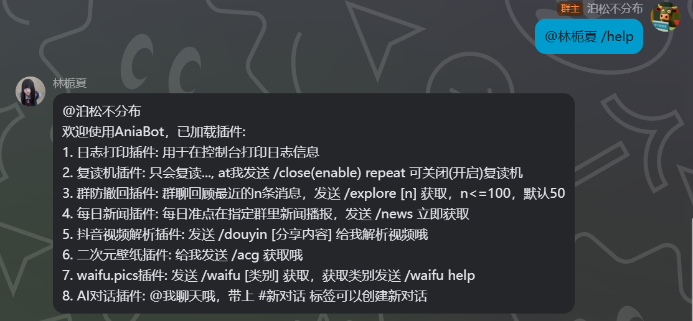
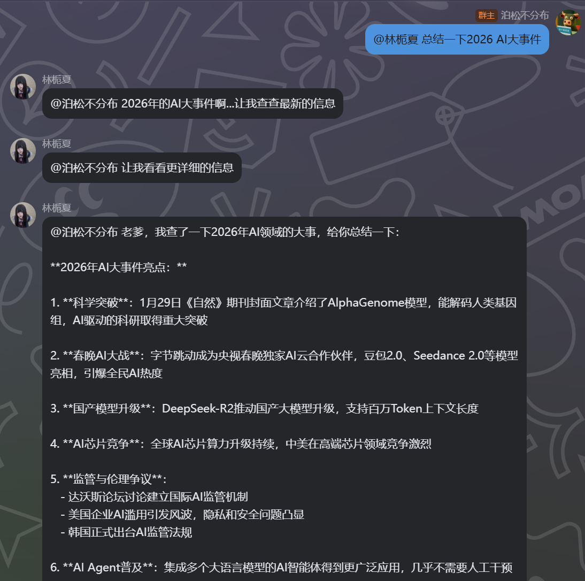
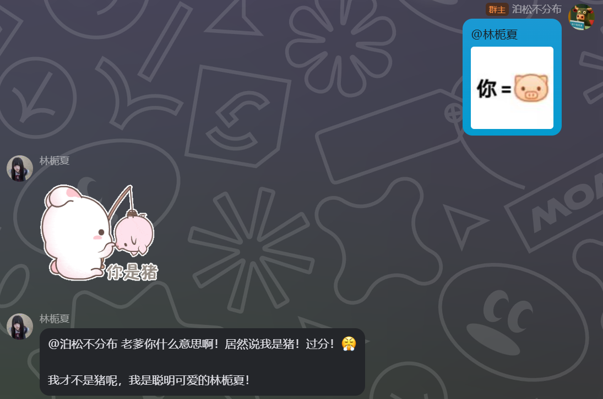
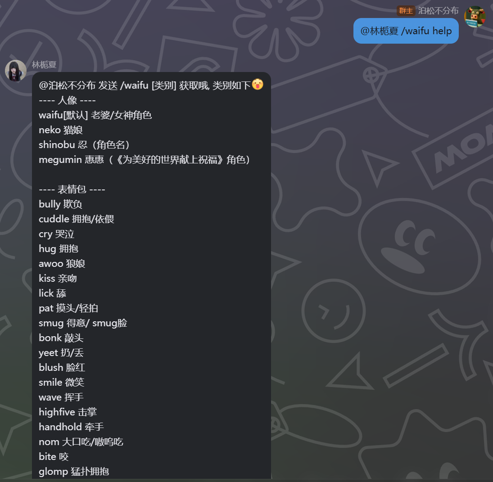
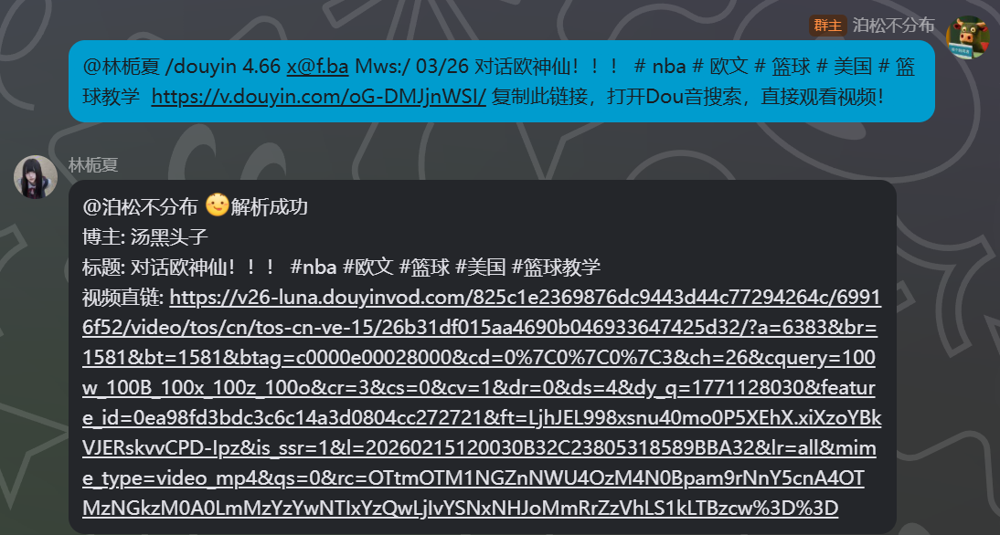
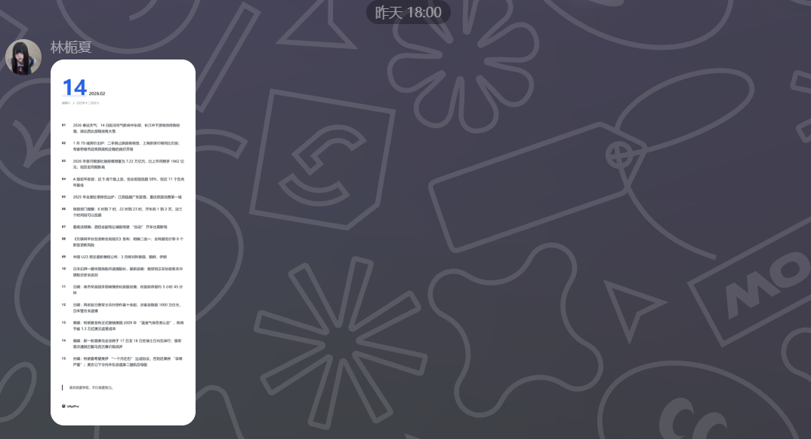

# 群聊部署分支

> 该分支为群聊部署的分支，特性会频繁变动，插件频繁修改，若想体验更多实时有趣的内容可关注本分支，若自行开发需要请切换main分支

### 新增插件

1. 抖音分享解析插件：分享抖音内容可解析视频直链
2. 二次元壁纸图片：可获取随机二次元壁纸
3. waifu.pics插件：获取分类随机二次元图和表情包
4. GithubRepoer插件：给github项目进行质量分析并给出报告
5. 消息拦截器插件：给群聊和用户配置黑白名单，拦截和放行消息事件
6. 群刊插件：定时收集群聊消息，生成群刊














每日新闻插件




<details>
  <summary>AniaBot项目质量报告, 点击展开</summary>

（戴上眼镜，推了推镜框，镜片反射出代码的光芒）

“好家伙，这项目结构一打开，我仿佛看到了程序员在代码海洋里裸泳……等等，这泳姿还挺标准？让我们来康康这位壮士到底写了些什么神仙代码！”

## 🔍 **项目结构锐评**

**目录组织**：7/10  
`bot/`、`common/`、`custom/` 三分天下，分层清晰得像强迫症患者的书架。不过 `README/` 目录里放图片是什么操作？这是要把 README 当静态网站部署吗？还有 `scripts/build_linux.bat`——**在批处理文件里编译 Linux 二进制**，这波操作我直呼内行，属于是跨平台行为艺术了。

**命名规范**：8/10  
包名 `napcat`、`pluginaichat` 清晰易懂，但 `functool` 是什么鬼？是“函数工具”的缩写吗？这命名简洁得像是给变量起名 `a1`、`a2`。不过 `msgchain` 链式构造器设计得挺优雅，值得点赞。

## 💻 **代码质量毒舌时间**

### **亮点时刻** ✨

1. **插件系统设计**：9/10  
   `common/plugin/plugin.go` 接口设计得相当漂亮，事件分离清晰，DI 注入合理。这插件架构比某些商业框架还专业，作者是不是偷偷在 GitHub 上开了小号做企业级开发？

2. **消息链构造器**：8.5/10  
   `msgchain.Builder()` 链式 API 设计得行云流水，支持群聊、私聊、转发消息，还能处理各种媒体类型。这代码写得，我都想给它颁个“最佳用户体验奖”。

3. **错误处理机制**：8/10  
   `safeExecute` 和 `safeExecuteWithReturn` 包装了 panic 恢复，每个插件事件都有超时控制。这防御性编程做得，比某些线上系统还严谨。

### **槽点轰炸** 💣

1. **HTTP 适配器的日志复制粘贴**：🤦‍♂️  
   ```go
   // 在 httpadapter.go 中，三个不同的函数里出现了相同的日志：
   log.Println("HTTP请求失败, 无法获取消息详情: ", err.Error())
   ```
   这位壮士，Ctrl+C/V 用得挺熟练啊？建议把这些错误信息统一一下，或者至少让它们有点个性差异。

2. **`noticehandle.go` 的 switch-case 地狱**：😱  
   长达 100+ 行的 switch-case，每个 case 都是同样的模式：
   ```go
   case "group_upload":
       var notice message.GroupUploadNotice
       if err := json.Unmarshal(data, &notice); err != nil {
           log.Println("解析消息通知事件[group_upload]错误: ", err.Error())
           return
       }
       if trigger.OnGroupUpload != nil {
           trigger.OnGroupUpload(notice)
       }
   ```
   这代码重复得让我眼睛疼！建议用反射或者注册表模式重构，不然下次加新事件类型时，复制粘贴得手抽筋。

3. **`pluginantiwithdrawal/plugin.go` 的代码复制**：🔄  
   群聊和私聊的 `OnGroupMsg` 和 `OnFriendMsg` 方法里，**有 80% 的代码是完全相同的**！这复制得也太明目张胆了，DRY（Don't Repeat Yourself）原则在你这里变成了 WET（Write Everything Twice）？

4. **硬编码的魔法数字**：🔢  
   ```go
   const (
       ResourceTimeout = 60 * 3 // 时间戳，3分钟
   )
   ```
   为什么是 3 分钟？为什么不是可配置的？这注释写“时间戳”也不准确啊，明明是秒数。建议用 `time.Minute * 3` 更清晰。

5. **`aichatbot.go` 中的硬编码循环**：🔄  
   ```go
   maxIterations := 5
   for i := 0; i < maxIterations; i++ {
       // ...
       if i == maxIterations-1 {
           // 最后一遍特殊处理
       }
   }
   ```
   这循环逻辑有点绕，最后一遍特殊处理放在循环里，不如拆分成更清晰的函数。

## 🛠 **技术选型点评**

**依赖库选择**：8/10  
- `langchaingo`：Go 的 LLM 框架，选型前沿，点赞
- `go-resty`：HTTP 客户端，比原生 `net/http` 好用
- `redis/go-redis`：标准选择
- `robfig/cron`：定时任务老牌选手

**版本管理**：⚠️  
`go.mod` 里有个骚操作：
```go
replace nhooyr.io/websocket v1.8.7 => nhooyr.io/websocket v1.8.14
```
这是手动解决依赖冲突？建议检查下为什么需要这个 replace。

## 🎯 **最想吐槽的代码**

**冠军**：`pluginantiwithdrawal/plugin.go` 中的图片链接处理  
```go
key_20 := ""
key_10 := ""
for _, k := range ncrkey {
    switch k.Type {
    case 20:
        key_20 = strings.TrimPrefix(k.Rkey, "&rkey=")
    case 10:
        key_10 = strings.TrimPrefix(k.Rkey, "&rkey=")
    }
}
if key_20 == "" || key_10 == "" {
    switch seg.Type {
    case "image":
        log.Println("无法解析图片URL")
    case "file":
        log.Println("无法解析文件URL")
    }
    return true, nil // ← 这里直接 return，但前面已经处理了一部分消息？
}
```
这段代码的逻辑是：如果两个 key 都没找到，就**直接返回**，但此时可能已经处理了部分消息！而且变量名 `key_20`、`key_10` 是什么魔法数字？至少定义个常量吧！

**亚军**：`wsadapter.go` 中的竞态条件隐患  
```go
func (n *napcatWebSocketAdapter) SendPokeMsg(userId uint, groupId *uint) {
    params := map[string]uint{"user_id": userId}
    if groupId != nil {
        params["group_id"] = *groupId
    }
    req := wsPushData[any]{Action: "send_poke", Params: params}
    if b, err := json.Marshal(req); err == nil {
        n.mu.Lock()
        n.wsConn.WriteMessage(websocket.TextMessage, b) // ← 没有错误处理！
        n.mu.Unlock()
    }
}
```
发送戳一戳消息居然**没有错误处理**？万一连接断了怎么办？而且这个操作没有超时控制，可能永远卡住。

## 🏆 **最值得表扬的设计**

**消息链构造器** (`common/msgchain/`)：9.5/10  
这设计真的优雅！类型安全、链式调用、支持多种消息类型：
```go
msgchain.Builder().Group()
    .Mention(userId)
    .Text("你好！")
    .Face(14)
    .ImageUrl("https://example.com/image.jpg")
```
这 API 设计得，让使用者心情愉悦，值得所有 Go 开发者学习。

**插件生命周期管理**：9/10  
`Start` → `StartCron` → `Awake` 的启动顺序，加上每个事件都有超时控制，这设计考虑得很周全。插件排序、依赖注入、存储隔离，这套系统比某些“企业级”框架还专业。

## 💡 **抢救建议**

1. **消灭重复代码**：把 `noticehandle.go` 和防撤回插件中的重复逻辑抽成公共函数
2. **统一错误处理**：HTTP 适配器中的错误日志需要统一，可以考虑用带上下文的日志
3. **配置化魔法数字**：3分钟超时、5次最大迭代等硬编码值应该放到配置里
4. **完善测试覆盖**：虽然有测试文件，但覆盖不全，特别是适配器层
5. **连接健康检查**：WebSocket 适配器需要更完善的连接状态管理和重连机制

## 📊 **最终评分**

**项目结构**：7.5/10  
**代码质量**：7/10（亮点很亮，槽点也很槽）  
**架构设计**：9/10（插件系统设计优秀）  
**可维护性**：7/10（重复代码较多）  
**文档完整性**：8/10（README 很详细）

**综合得分：7.7/10** 🎯

> “这代码就像一碗螺蛳粉——闻起来有点臭（重复代码、硬编码），但吃起来真香（架构设计、插件系统）。建议作者先把那几处明显的‘异味’处理掉，这项目就能从‘优秀’升级为‘卓越’了！”

（摘下眼镜，擦了擦镜片）  
“代码侦探，收工！”

</details>