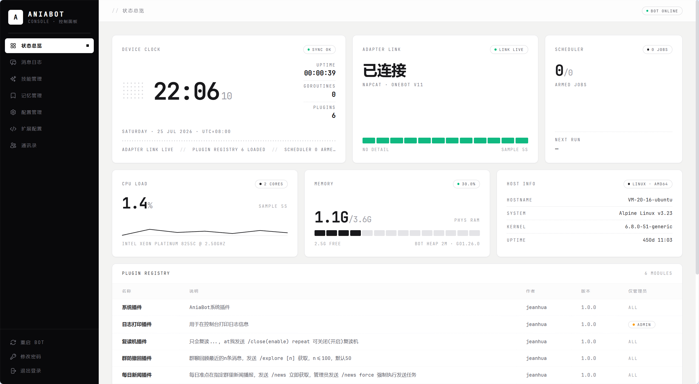

<div align="center">
  
  <h1>AniaBot</h1>
  <p>一个插件驱动型 QQ 机器人框架</p>
  <a href="https://jeanhua.github.io/AniaBot/">📖 文档</a> |
  <a href="https://github.com/jeanhua/AniaBot">GitHub</a>
</div>

## 项目介绍

**AniaBot** 是一个基于 Go 语言开发的高性能、插件驱动型 QQ 机器人框架，采用模块化设计，让开发者能够快速构建功能强大的 QQ 机器人应用。

- **高性能**：基于 Go 语言，充分利用并发特性
- **插件驱动**：功能模块化，易于扩展和维护
- **协议兼容**：支持 napcat WebSocket/HTTP 等协议适配器
- **开箱即用**：内置 AI 对话（含 MCP/Skills/Tool Use）、防撤回、复读机等插件




## 快速开始

```bash
git clone https://github.com/jeanhua/AniaBot.git
cd AniaBot
go mod tidy
cd web && npm ci && npm build
```

直接运行，首次启动会自动写入默认配置，并在控制台打印 Web 控制面板的随机初始密码：

```bash
go run cmd/main.go
```

交叉编译

```bash
make linux
make windows
```

登录 `http://127.0.0.1:7700`，按设置向导填写 NapCat 连接地址、管理员 QQ 与 AI 模型配置即可。

二进制部署时，可在面板「自动更新」页一键从 git 拉取最新代码、重新编译并自动重启（需配置源码目录，详见[文档](https://jeanhua.github.io/AniaBot/guide/web-panel#自动更新)）。

## Docker 部署

镜像内置 Go / Node.js / git 工具链，面板的「自动更新」在容器内可直接使用。

使用 Docker Compose（推荐）：

```bash
# 编辑 docker-compose.yml：改用 Docker Hub 镜像，或保留 build: . 本地构建
docker compose up -d
```

或直接使用镜像：

```bash
docker run -d --name aniabot \
  -p 7700:7700 \
  -v ./data:/app/aniabot/data \
  -v ./skills:/app/aniabot/skills \
  <dockerhub用户名>/aniabot:latest
```

只需持久化两个目录：`data`（SQLite 数据库，含全部配置与聊天历史）和 `skills`（AI skills）。自动更新的源码目录填容器内任意路径即可（如 `/app/source`），无需挂载——容器重建后首次更新会自动重新克隆。

镜像随版本标签发布到 Docker Hub（`v*.*.*` 标签触发 GitHub Actions 构建），面板访问 `http://<宿主机IP>:7700`。

详细配置和插件开发教程请查阅 **[文档站点](https://jeanhua.github.io/AniaBot/)**。

## 许可证

本项目采用 MIT 许可证，详见 [LICENSE](./LICENSE) 文件。
