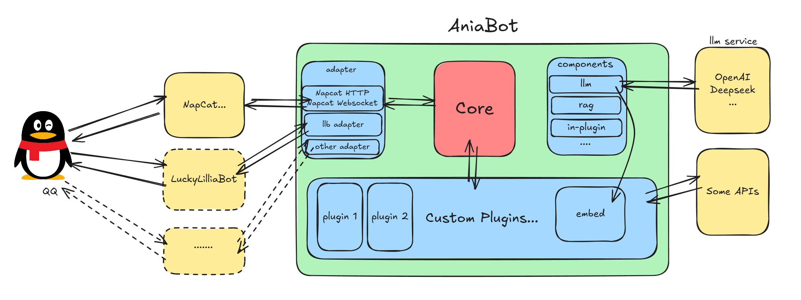

<div align="center">
  
  <h1>AniaBot</h1>
  <p>一个插件驱动型 QQ 机器人框架</p>
</div>

## 项目介绍

**AniaBot** 是一个基于 Go 语言开发的高性能、插件驱动型 QQ 机器人框架。它采用模块化设计，提供了丰富的插件生态和灵活的扩展能力，让开发者能够快速构建功能强大的 QQ 机器人应用。

### 🚀 框架特色

- **高性能**：基于 Go 语言开发，充分利用并发特性，支持高并发消息处理
- **插件驱动**：采用插件化架构，功能模块化，易于扩展和维护
- **协议兼容**：支持多种 QQ 机器人协议适配器（如 napcat websocket/http）
- **配置灵活**：基于 Viper 的配置文件管理
- **开发友好**：提供完整的插件开发文档和示例代码

### 💡 核心优势

1. **开箱即用**：内置多个实用插件，包括 AI 对话、防撤回、复读机等
2. **易于扩展**：简洁的插件接口，快速开发自定义功能
3. **稳定可靠**：完善的错误处理机制，保证机器人稳定运行

### 系统架构



**AniaBot** 采用分层架构设计，确保系统的高内聚、低耦合：

#### 🏗️ 架构层次

**协议适配层 (Adapter Layer)**
- 负责与 QQ 协议进行通信，支持多种协议适配器
- 处理网络连接、消息收发等底层通信

**核心引擎层 (Core Engine)**
- 消息分发：接收协议层消息，分发给相应插件
- 插件管理：插件的注册、加载生命周期管理
- 事件调度：基于优先级的事件处理机制
- 命令解析：命令识别和参数提取

**插件生态层 (Plugin Ecosystem)**
- 丰富的内置插件：AI对话、防撤回、复读机等
- 自定义插件接口：简洁的插件开发API

**配置管理层 (Configuration Management)**
- 基于 Viper 的统一配置管理
- 支持 YAML 格式配置文件
- 插件独立配置：每个插件可拥有独立配置节

#### 🔧 模块化设计

AniaBot 采用模块化设计理念：

1. **组件分离**：各功能模块职责明确，便于维护
2. **接口抽象**：通过接口定义模块间的交互契约
4. **可扩展性**：易于添加新功能模块和协议支持

## 🚀 快速开始

### 环境要求

- **Go 语言**：1.25.5 或更高版本
- **协议适配器**：可用的 QQ 机器人协议适配器（如 napcat）、redis
- **操作系统**：Windows、Linux、macOS 均可

### 安装与运行

#### 方式一：源码安装（推荐）

1. **克隆项目**
```bash
git clone https://github.com/jeanhua/AniaBot.git
cd AniaBot
```

2. **安装依赖**
```bash
go mod tidy
```

3. **配置机器人**
编辑 `config.yaml` 文件，配置你的机器人参数：

```yaml
# bot配置
bot:
  # 管理员信息
  admin_id: # 管理员qq
  # napcat网络交换适配器
  adapter:
    ws:
      address: ws://localhost:4455 # websocket 地址，napcat的ws server地址
      max_retries: 5 # 连接失败时最大重连次数
```

4. **运行机器人**
```bash
go run cmd/main.go
```

#### 方式二：直接导入

```bash
go get -u github.com/jeanhua/AniaBot
```

编写`config.yaml`文件，同上

然后创建你的主程序文件：

```go
package main

import (
    "github.com/jeanhua/AniaBot/ania/aniabot"
    "github.com/jeanhua/AniaBot/ania/adapter/napcat"
    "github.com/jeanhua/AniaBot/ania/plugins/pluginaichat"
    "github.com/jeanhua/AniaBot/ania/plugins/pluginlog"
)

func main() {
    // 创建协议适配器
    adapter := napcat.NewNapcatWebSocketAdapter()
    
    // 创建机器人实例
    bot := aniabot.NewAniaBot(adapter)
    
    // 注册插件
    bot.AddPlugin(pluginlog.NewPlugin())          // 日志插件
    bot.AddPlugin(pluginaichat.NewAIChatPlugin()) // AI对话插件
    
    // 启动机器人
    bot.Run()
}
```

### 📋 配置说明

#### 插件配置

每个插件都有独立的配置节，例如：

```yaml
plugins:
  ai_chat_bot:
    base_url: "https://api.openai.com/v1"
    api_key: "your-api-key"
    model: "gpt-3.5-turbo"
    max_token: 2048
    temperature: 0.7
```

### 🔧 调试技巧

1. **启用日志插件**：便于查看消息处理流程
2. **检查网络连接**：确保协议适配器正常运行
3. **查看错误日志**：关注控制台输出的错误信息
4. **测试基础功能**：先测试简单的消息收发功能

---

接下来，让我们开始编写你的第一个插件！

## 插件开发教学

### 第一部分：基础概念

#### 什么是插件？
在 **AniaBot** 中，插件是扩展机器人功能的基本单元。每个插件可以处理特定类型的消息事件，实现自定义的业务逻辑。

#### 插件的基本结构
每个插件需要实现以下基本结构：

```go
type YourPlugin struct {
    plugin.Meta
}

func NewPlugin() *YourPlugin {
    return &YourPlugin{
        Meta: plugin.Meta{
            Name:      "插件名称",
            HelpWords: "插件描述",
            AdminOnly: false, // 当该字段为true时非管理员发送/help不会显示插件信息
            Order:     0, // 插件执行顺序，从小到大
        },
    }
}
```

### 第二部分：创建你的第一个插件

#### 步骤 1：创建插件目录
在 `custom/plugins/` 目录下创建一个新的文件夹，例如 `pluginhello`。

#### 步骤 2：创建插件文件
在 `pluginhello` 目录下创建 `hello.go` 文件：

```go
package pluginhello

import (
    "github.com/jeanhua/AniaBot/common/bot"
    "github.com/jeanhua/AniaBot/common/model/command"
    "github.com/jeanhua/AniaBot/common/model/message"
    "github.com/jeanhua/AniaBot/common/msgchain"
    "github.com/jeanhua/AniaBot/common/plugin"
)

type HelloPlugin struct {
    plugin.Meta
}

func NewPlugin() *HelloPlugin {
    return &HelloPlugin{
        Meta: plugin.Meta{
            Name:      "问候插件",
            HelpWords: "一个简单的问候插件，发送 /hello 触发",
            AdminOnly: false,
            Order:     10,
        },
    }
}

// 处理群聊消息
func (p *HelloPlugin) OnGroupMsg(bot bot.Bot, cmd command.Command, msg message.Message) bool {
    if cmd.Name == "hello" {
        builder := msgchain.Builder().Group()
        builder.Text("你好！我是 AniaBot，很高兴为你服务！")
        bot.SendGroupMsg(msg.GroupId, builder.Build())
        return false // 阻止后续插件执行
    }
    return true // 继续执行后续插件
}
```

#### 步骤 3：注册插件
在 `cmd/main.go` 中注册你的插件：

```go
import (
    // 其他导入...
    "github.com/jeanhua/AniaBot/custom/plugins/pluginhello"
)

func main() {
    adapter := napcat.NewNapcatWebSocketAdapter()
    bot := aniabot.NewAniaBot(adapter)
    
    // 注册你的插件
    bot.AddPlugin(pluginhello.NewPlugin())
    
    bot.Run()
}
```

### 第三部分：消息构造器使用

#### 基础消息构造
**AniaBot** 提供了强大的消息构造器，支持多种消息类型：

```go
// 创建群聊消息构造器
builder := msgchain.Builder().Group()
// 创建好友消息构造器
builder := msgchain.Builder().Friend()

// 添加文本消息
builder.Text("这是一条文本消息")

// 添加表情
builder.Face(14) // 微笑表情

// 添加图片（支持URL、Base64、本地文件）
builder.ImageUrl("https://example.com/image.jpg")
builder.ImageLocal("./images/avatar.png")

// 回复消息
builder.Reply(msg.MessageId)

// AT某人（仅群聊）
builder.Mention(msg.Sender.UserId)

// 发送群聊消息
bot.SendGroupMsg(msg.GroupId, builder.Build())
// 发送好友消息
bot.SendFriendMsg(msg.Sender.UserId, builder.Build())

// 文件、视频、语音消息类似...
```

#### 消息构造器 API 列表

- `Text(text string)` - 添加文本消息
- `Face(faceId uint)` - 添加表情（参考QQ表情ID）
- `ImageUrl(url string)` - 添加网络图片
- `ImageBase64(bs64code string)` - 添加Base64编码图片
- `ImageLocal(path string)` - 添加本地图片
- `Reply(msgId uint)` - 回复消息
- `RecordUrl(url string)` - 添加网络语音
- `RecordLocal(path string)` - 添加本地语音
- `Mention(userId uint)` - AT群成员（仅群聊）
- `Raw(rawMsg []message.OB11Segment)` - 添加原始消息段
- 更多请查阅 [定义](./common/msgchain/chainbuilder.go)

### 第四部分：高级插件功能

#### 命令处理
**AniaBot** 提供了强大的命令解析功能：

```go
func (p *YourPlugin) OnGroupMsg(bot bot.Bot, cmd command.Command, msg message.Message) bool {
    if cmd.Mention{ // 当机器人被At时
        switch cmd.Name {
        case "weather":
            // 处理天气查询
            if len(cmd.Args) > 0 {
                city := cmd.Args[0]
                // 查询天气逻辑...
            }
        case "music":
            // 处理音乐搜索
        case "detail":
            // 显示细节信息
        }
    }
    return true
}
```

#### 插件配置
插件支持配置文件读取：

```go
func (p *YourPlugin) Start(cfg *viper.Viper) {
    // 读取插件配置
    apiKey := cfg.GetString("plugins.yourplugin.api_key")
    timeout := cfg.GetInt("plugins.yourplugin.timeout")
    
    // 初始化插件资源
    p.InitializeResources(apiKey, timeout)
}
```

在 `config.yaml` 中添加配置：

```yaml
plugins:
  yourplugin:
    api_key: "your-api-key"
    timeout: 30
```

#### 插件执行顺序控制
通过 `Order` 字段控制插件执行顺序：

```go
Meta: plugin.Meta{
    Name:      "权限验证插件",
    Order:     1, // 较小的数字先执行
}

Meta: plugin.Meta{
    Name:      "日志记录插件", 
    Order:     100, // 较大的数字后执行
}
```

#### 插件数据存储

**AniaBot**使用Redis作为存储数据库，请先配置完成Redis，并填写Bot的`config.yaml`配置文件

如何使用：

```go
func (p *YourPlugin) ForExampleSomeEvent {
    data, ok := p.Storage.GetString(context.Background(), "key")
    // ...其他读写数据方法
}
```

其他方法参考 [定义](./common/storage/storage.go)

> 注意：**AniaBot**通过key前缀为每个插件创建独立的存储空间，不同插件数据读写互不干扰，空间分配依据插件名称的base64编码，所以修改插件名称后，插件原数据内容将无法访问，请在修改前清空或转移数据

### 第五部分：完整示例

#### 天气查询插件

```go
package pluginweather

import (
    "fmt"
    "github.com/jeanhua/AniaBot/common/bot"
    "github.com/jeanhua/AniaBot/common/model/command"
    "github.com/jeanhua/AniaBot/common/model/message"
    "github.com/jeanhua/AniaBot/common/msgchain"
    "github.com/jeanhua/AniaBot/common/plugin"
)

type WeatherPlugin struct {
    plugin.Meta
    apiKey string
}

func NewPlugin() *WeatherPlugin {
    return &WeatherPlugin{
        Meta: plugin.Meta{
            Name:      "天气查询",
            HelpWords: "查询天气，使用方式：/weather 城市名",
            AdminOnly: false,
            Order:     20,
        },
    }
}

func (p *WeatherPlugin) Start(cfg *viper.Viper) {
    p.apiKey = cfg.GetString("plugins.weather.api_key")
}

func (p *WeatherPlugin) OnGroupMsg(bot bot.Bot, cmd command.Command, msg message.Message) bool {
    if cmd.Name == "weather" {
        if len(cmd.Args) == 0 {
            builder := msgchain.Builder().Group()
            builder.Text("请指定城市名称，例如：/weather 北京")
            bot.SendGroupMsg(msg.GroupId, builder.Build())
            return false
        }
        
        city := cmd.Args[0]
        weatherInfo := p.queryWeather(city)
        
        builder := msgchain.Builder().Group()
        builder.Text(fmt.Sprintf("%s的天气：%s", city, weatherInfo))
        bot.SendGroupMsg(msg.GroupId, builder.Build())
        
        return false
    }
    return true
}

func (p *WeatherPlugin) queryWeather(city string) string {
    // 这里实现天气查询逻辑
    // 可以使用第三方天气API
    return "晴，25°C"
}
```

## 插件接口参考

### 主要事件接口

- `OnGroupMsg(bot.Bot, command.Command, message.Message) bool` - 群聊消息处理
- `OnFriendMsg(bot.Bot, command.Command, message.Message) bool` - 私聊消息处理
- `Start(cfg *viper.Viper)` - 插件初始化

### 消息通知接口

更多事件接口请参考 [插件定义文件](./common/plugin/metainfo.go)

## 系统内置插件介绍

**AniaBot** 内置了多个实用的系统插件，开箱即用，为开发者提供了丰富的功能参考。

### 1. 日志打印插件 (pluginlog)

**功能描述**：在控制台打印所有接收到的消息，便于调试和监控。

**主要特性**：
- 群聊和私聊消息日志记录
- 显示发送者昵称和用户ID

**使用方式**：

```go
import "github.com/jeanhua/AniaBot/ania/plugins/pluginlog"

bot.AddPlugin(pluginlog.NewPlugin())
```

### 2. 复读机插件 (pluginrepeat)

**功能描述**：自动复读群聊中重复出现的消息，增加群聊趣味性。

**主要特性**：
- 当同一条消息连续出现3次时自动复读
- 支持管理员控制开关
- 基于群聊的独立计数

**控制命令**：
- `@机器人 /close repeat` - 关闭复读机（管理员）
- `@机器人 /enable repeat` - 开启复读机（管理员）

**使用方式**：
```go
import "github.com/jeanhua/AniaBot/ania/plugins/pluginrepeat"

bot.AddPlugin(pluginrepeat.NewPlugin())
```

### 3. AI对话插件 (pluginaichat)

**功能描述**：集成AI聊天功能，支持文本和图片内容理解。

**主要特性**：
- 支持多种AI模型接口（OpenAI兼容）
- 图片OCR识别功能
- 上下文记忆和并发控制
- 超时处理和错误恢复

**触发方式**：
- 在群聊或私聊中@机器人即可开始对话

**配置示例**（在config.yaml中）：
```yaml
plugin:
  ai_chat_bot:
    base_url: "https://api.openai.com/v1"
    model: "gpt-3.5-turbo"
    api_key: "your-api-key"
    max_token: 2048
    temperature: 0.7
    prompt: "你是一个AI助手"
    ocr:
      enable: true
      base_url: "https://api.openai.com/v1"
      model: "gpt-4-vision-preview"
      api_key: "your-ocr-api-key"
```

**使用方式**：
```go
import "github.com/jeanhua/AniaBot/ania/plugins/pluginaichat"

bot.AddPlugin(pluginaichat.NewAIChatPlugin())
```

### 4. 防撤回插件 (pluginantiwithdrawal)

**功能描述**：记录群聊消息，防止消息被撤回后无法查看。

**主要特性**：
- 缓存最近的100条群聊消息
- 支持消息回顾功能
- 转发消息格式优化

**使用命令**：

在群聊中

- `@机器人 /explore [数量]` - 查看最近的消息（默认50条，最多100条）

在私聊中(仅管理员)

- `@机器人 /explore [群号] [数量]` - 查看某个群最近的消息（默认50条，最多100条）

**使用方式**：

```go
import "github.com/jeanhua/AniaBot/ania/plugins/pluginantiwithdrawal"

bot.AddPlugin(pluginantiwithdrawal.NewPlugin())
```

### 系统插件注册示例

在 `cmd/main.go` 中注册所有系统插件：

```go
import (
    "github.com/jeanhua/AniaBot/ania/plugins/pluginlog"
    "github.com/jeanhua/AniaBot/ania/plugins/pluginrepeat"
    "github.com/jeanhua/AniaBot/ania/plugins/pluginaichat"
    "github.com/jeanhua/AniaBot/ania/plugins/pluginantiwithdrawal"
)

func main() {
    adapter := napcat.NewNapcatWebSocketAdapter()
    bot := aniabot.NewAniaBot(adapter)
    
    // 注册系统插件
    bot.AddPlugin(pluginlog.NewPlugin())           // 日志插件
    bot.AddPlugin(pluginrepeat.NewPlugin())        // 复读机插件
    bot.AddPlugin(pluginaichat.NewAIChatPlugin())  // AI对话插件
    bot.AddPlugin(pluginantiwithdrawal.NewPlugin()) // 防撤回插件
    
    bot.Run()
}
```

## 最佳实践

1. **错误处理**：在插件中妥善处理错误，避免机器人崩溃
2. **资源管理**：在插件中合理管理资源，避免内存泄漏
3. **性能优化**：避免在插件中进行耗时的同步操作
4. **配置分离**：将配置信息放在配置文件中，便于管理

## 故障排除

### 常见问题

1. **插件未生效**：检查插件是否正确注册，Order 值是否合理
2. **消息发送失败**：检查网络连接和协议适配器配置
3. **配置读取失败**：检查 config.yaml 文件格式和路径

### 调试技巧

启用日志插件可以帮助调试：
```go
bot.AddPlugin(pluginlog.NewPlugin())
```

## 贡献指南

欢迎提交 Issue 和 Pull Request 来改进 **AniaBot**。在提交代码前请确保：

1. 代码符合 Go 语言规范
2. 添加适当的测试用例
3. 更新相关文档

## 许可证

本项目采用 MIT 许可证，详见 LICENSE 文件。

## 联系方式

- 项目主页：https://github.com/jeanhua/AniaBot
- 问题反馈：https://github.com/jeanhua/AniaBot/issues

