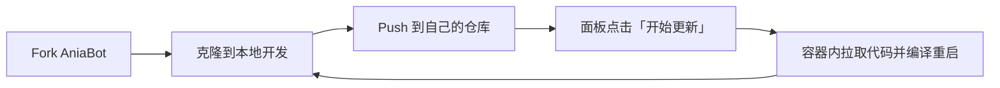

# 容器部署

推荐使用 **Docker + Fork 工作流** 部署 AniaBot：Fork 项目到自己的账号，在本地开发、Push 到自己的仓库，然后在面板的「自动更新」页填一次 Git 地址，之后每次更新只需 Push 代码、在面板点一下按钮，容器内就会自动拉取你的最新代码并完成编译重启。

## 为什么推荐这种方式

- **官方镜像自带完整工具链**：镜像内置 git / Go / Node.js / npm，面板的「自动更新」流水线（拉代码 → 拉依赖 → 构建前端 → 编译 → 替换重启）在容器内可直接执行，无需在宿主机安装任何编译环境
- **改代码零部署成本**：自定义插件、修改内置功能后，Push 到自己 Fork 的仓库即可，不需要自己构建镜像
- **数据与代码分离**：容器只持久化 `data`（数据库）和 `skills`（AI skills），升级镜像、重建容器都不丢数据

整体工作流：



## 第一步：Fork 并克隆项目

1. 打开 [github.com/jeanhua/AniaBot](https://github.com/jeanhua/AniaBot)，点击右上角 **Fork**，将项目复制到自己的账号下
2. 克隆你 Fork 的仓库到本地：

```bash
git clone https://github.com/<你的用户名>/AniaBot.git
cd AniaBot
```

3. 在本地开发你的功能（自定义插件参考 [插件开发](/plugin/overview)），提交并 Push 到自己的仓库：

```bash
git add .
git commit -m "feat: 我的自定义功能"
git push origin main
```

::: tip 同步上游更新
官方仓库有新版本时，在你 Fork 的仓库页面点击 **Sync fork**（或本地 `git remote add upstream` 后合并），即可把官方更新合入你的仓库，随后同样在面板一键更新部署。
:::

## 第二步：编写 docker-compose.yml

在服务器上新建一个目录（如 `aniabot/`），创建 `docker-compose.yml`：

```yaml
services:
  aniabot:
    image: jeanhua/aniabot:latest
    container_name: aniabot
    restart: unless-stopped
    network_mode: host
    volumes:
      - ./data:/app/aniabot/data        # 持久化数据（SQLite 等）
      - ./skills:/app/aniabot/skills    # AI skills 目录
    environment:
      TZ: Asia/Shanghai
      # 如需 MySQL 作为持久化存储：
      # ANIABOT_STORE_DRIVER: mysql
      # ANIABOT_MYSQL_DSN: user:pass@tcp(mysql:3306)/aniabot
```

启动：

```bash
docker compose up -d
```

说明：

- `network_mode: host` 让容器直接使用宿主机网络，方便连接同机部署的 NapCat（如 `127.0.0.1:4455`），面板监听 `7700` 端口
- 只需要挂载 `data` 和 `skills` 两个目录，自动更新用到的源码目录放在容器内即可，**无需挂载源码目录**（重建容器后会自动重新克隆）

## 第三步：首次启动与初始化

查看控制台打印的面板**初始密码**（仅显示一次）：

```bash
docker logs aniabot
```

浏览器访问 `http://<服务器IP>:7700`，用初始密码登录，首次登录会进入**设置向导**：依次填写 NapCat 连接地址、管理员 QQ 与 AI 模型配置，保存后自动重启生效。

::: warning NapCat 需要单独部署
容器内只运行 AniaBot 本体，QQ 协议端 NapCat 请参照 [快速开始](/guide/getting-started#第一步：部署-napcat) 另行部署（宿主机或另一个容器均可，host 网络模式下直接填 `127.0.0.1` 的地址）。
:::

## 第四步：配置自动更新（关键一步）

登录面板，进入 **配置管理 → 自动更新** 分组，填写三项：

| 键 | 填什么 | 示例 |
| --- | --- | --- |
| `bot.update.git_url` | **你 Fork 的仓库地址** | `https://github.com/<你的用户名>/AniaBot.git` |
| `bot.update.source_dir` | 容器内的源码目录（任意路径，无需挂载） | `/app/aniabot/src` |
| `bot.update.branch` | 跟踪的分支 | `main` |

保存配置并重启后，进入面板「自动更新」页，点击 **开始更新**。首次更新会自动把仓库克隆到 `source_dir`，随后执行完整流水线：**拉取代码 → `go mod tidy` → 构建前端 → 编译 → 替换二进制并重启**，全过程实时日志可见。流水线任一阶段失败都会中止，当前运行的版本不受影响（详见 [Web 控制面板 — 自动更新](/guide/web-panel#自动更新)）。

之后的日常迭代就是一个循环：

1. 本地改代码
2. `git push` 到自己的仓库
3. 面板「自动更新」页点 **开始更新**，等一两分钟，机器人就跑上你的最新版本了 🎉

::: warning 源码目录不要指向开发仓库
`bot.update.source_dir` 是面板专用的克隆目录，更新时执行的是 `git reset --hard`，会丢弃目录内的一切本地改动。它不需要、也不应该挂载到宿主机或指向你的开发目录。
:::

## 私有仓库的认证

GitHub 上 Fork 的仓库默认是公开的，上述配置开箱即用。如果你把仓库设为**私有**，需要在 `bot.update.git_url` 中带上访问令牌（Personal Access Token，需有仓库读取权限）：

```
https://<token>@github.com/<你的用户名>/AniaBot.git
```

::: danger 注意
带 Token 的地址属于敏感信息，请确认面板密码足够强，且不要将面板端口直接暴露到公网。
:::

## 升级镜像本身

官方发布新镜像后（`latest` 标签随版本更新）：

```bash
docker compose pull
docker compose up -d
```

数据库和 skills 都在挂载卷里，不受影响；容器内的源码目录会随容器重建清空，下次在面板点「开始更新」时会按 `bot.update.git_url` 自动重新克隆——这也是为什么推荐把 `git_url` 指向你自己的仓库。

## 常见问题

**面板「自动更新」按钮不可用？**
确认三项配置已保存并重启过容器（配置变更需重启生效），且不是以 `go run` 开发模式运行（容器部署不存在此问题）。

**更新卡在「拉取代码」阶段？**
多为网络或认证问题：检查服务器能否访问 GitHub、`git_url` 是否正确、私有仓库是否带了有效 Token。必要时可为服务器配置代理。

**更新后想回滚？**
旧版本二进制保留为同目录下的 `<程序名>.old`，进入容器手动替换回去并重启即可；或者把仓库回退到上一个提交再触发一次更新。
