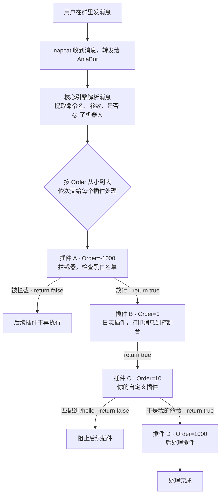
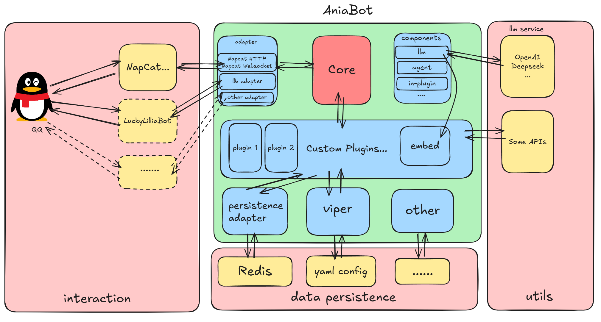

# 项目介绍

**AniaBot** 是一个基于 Go 语言开发的高性能、插件驱动型 QQ 机器人框架。它采用模块化设计，提供简洁的插件接口和丰富的内置功能，让开发者能够快速构建功能强大的 QQ 机器人应用。

## 它能做什么？

先看看用 AniaBot 已经实现的插件，给你一些灵感：

| 插件 | 功能 | 涉及技术 |
|------|------|---------|
| 二次元壁纸 | 发送 `/acg` 获取随机动漫壁纸 | HTTP API、图片发送 |
| 音乐点歌 | `/music 周杰伦` 搜索并发送音乐文件 | 分页交互、文件发送 |
| 群刊生成 | 自动收集群消息，AI 生成幽默群刊 | LLM 集成、缓存持久化、定时任务 |
| 抖音解析 | 自动识别抖音链接，发送无水印视频 | 正则匹配、URL 解析 |
| GitHub 分析 | 输入仓库链接，AI 生成项目分析报告 | LLM 工具调用、Markdown 转图片 |
| 聊天记录伪造 | 私聊交互式创建合并转发消息 | 多步会话状态管理 |
| 消息拦截器 | 黑白名单过滤无关消息 | 高优先级 Order、配置驱动 |

这些插件都在 `custom/plugins/` 目录下，每个都是完整可运行的示例，也是你学习插件开发的最佳参考。

## 框架特色

- **高性能**：基于 Go 语言开发，充分利用并发特性，支持高并发消息处理
- **插件驱动**：采用插件化架构，功能模块化，易于扩展和维护
- **协议兼容**：支持多种 QQ 机器人协议适配器（如 napcat WebSocket/HTTP）
- **配置灵活**：基于 Viper 的配置文件管理，支持 YAML 格式
- **开发友好**：简洁的插件接口，几十行代码即可完成一个功能插件

## 消息是怎么被处理的？

当群里有人发一条消息时，AniaBot 的处理流程如下：

每个插件只需要关心自己负责的命令，其他消息直接 `return true` 传给下一个插件。就像一条流水线，每个工位只处理自己会的工序。

## 系统架构

AniaBot 采用分层架构设计，确保高内聚、低耦合：

### 协议适配层

负责与 QQ 协议进行通信。你可以把它理解为「翻译官」——它把 napcat 发来的 WebSocket 消息翻译成框架能理解的格式，也把框架要发送的消息翻译成 napcat 能理解的格式。目前支持 WebSocket 和 HTTP 两种适配器。

### 核心引擎层

框架的「大脑」，负责：

- **消息分发**：接收协议层消息，路由给相应插件处理
- **插件管理**：插件的注册、加载和生命周期管理
- **事件调度**：基于优先级（`Order` 字段）的事件处理机制
- **命令解析**：识别命令名称、提取参数
- **存储抽象**：为插件提供缓存（Redis/内存）和持久化（SQLite/MySQL）双层存储接口

### 插件生态层

所有功能都以插件形式存在。框架内置了 6 个常用插件（日志、AI 对话、复读机等），你也可以编写自己的插件。插件之间互不干扰，可以自由组合。

### 配置管理层

基于 Viper 的统一配置管理，支持 YAML 格式。每个插件拥有独立的配置节，互不冲突。

## 项目仓库

| 分支 | 说明 |
|------|------|
| [main](https://github.com/jeanhua/AniaBot) | 框架主分支，稳定版本 |
| [dev/deploy](https://github.com/jeanhua/AniaBot/tree/dev/deploy) | 部署分支，包含丰富的插件示例 |
