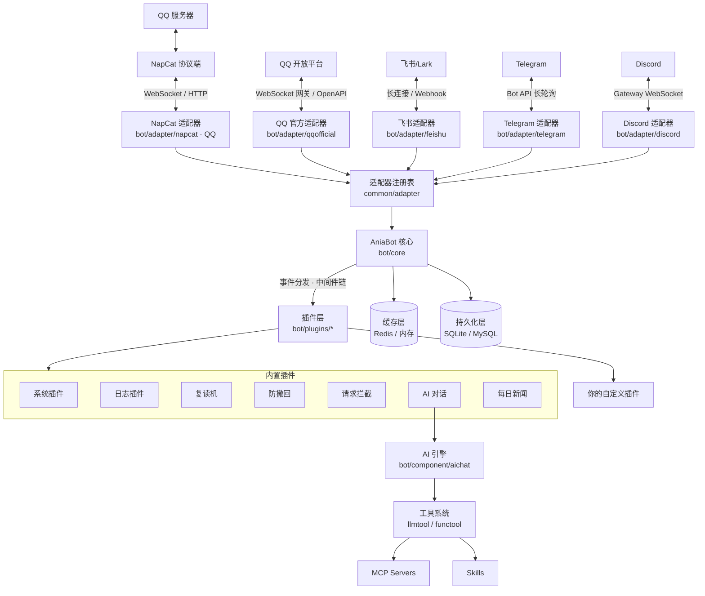

# 项目介绍

**AniaBot** 是一个基于 Go 语言开发的高性能、插件驱动型**多平台**机器人框架。它通过可插拔的适配器接入各平台 —— QQ 经 [NapCat](https://napneko.github.io/) 以 OneBot v11 协议、QQ 官方经 QQ 开放平台 API v2（WebSocket 网关，无需公网地址）、飞书/Lark 经官方 SDK（WebSocket 长连接 / Webhook）、Telegram 经 Bot API（长轮询，无需公网地址）、Discord 经 discordgo（Gateway WebSocket，无需公网地址）——并内置了一套由 OpenAI 兼容大模型驱动的 AI 对话引擎 —— 支持工具调用（Tool Use）、MCP（Model Context Protocol）、Skill 系统与 AI 定时任务。

## 设计理念

AniaBot 的核心哲学是 **「一切皆为插件」**：

- 框架本身只做三件事：连接平台适配器、分发消息事件、管理插件生命周期
- 所有功能 —— 包括 AI 对话、防撤回、复读机 —— 都是插件，与你将要编写的插件地位完全平等
- 内置插件同时也是最好的开发参考：它们的写法就是你写自定义插件的写法

## 多平台模型

框架把所有平台归一化为 **OneBot v11 消息段格式**（`OB11Segment{Type, Data}`）作为通用消息形态，适配器在边界做双向翻译。多平台可并存（QQ + QQ 官方 + 飞书 + Telegram + Discord 同时在线）：

- **ID 前缀体系**：QQ 历史裸数字 ID 无前缀（存量数据零迁移），其他平台统一加前缀（如 QQ 官方 `qo:`、飞书 `fs:`、Telegram `tg:`、Discord `dc:`，消息 ID 形如 `dc:<channel_id>:<message_id>`）；core 按前缀路由到对应适配器
- **能力分层**：公共能力（发群/私聊消息、查消息/群/历史）在 `bot.Bot`，平台专属能力（合并转发、戳一戳、rkey 等）在可选接口 `bot.QQ`，插件类型断言探测、自动退化
- **新增平台** = 实现一个适配器包 + `cmd/main.go` 加一行空白导入，框架核心零改动（见 [快速开始](/guide/getting-started)）

## 整体架构



## 核心特性

### ⚡ 高性能事件处理

WebSocket 适配器采用 **工作池（Worker Pool）+ 消息队列** 模型：连接层只负责收发，事件解析与插件分发在独立的工作协程中完成。`worker_count` 设为 0 时按 CPU 核数自动调整，队列长度可通过 `worker_queue_size` 配置。

### 🧩 中间件式插件链

插件按 `Order` 从小到大排序执行，消息事件返回 `false` 即可阻断后续插件 —— 就像 Web 框架的中间件：

```
LevelLog(-1000)  →  LevelNormal(0)  →  LevelPostHandle(1000)
   日志插件            业务插件             AI 对话（兜底响应）
```

### 🤖 完整的 AI Agent 能力

- **工具调用**：内置时间、联网搜索、网页浏览、梗图、消息历史、文件发送等工具，反射自动生成 JSON Schema，无需手写
- **MCP 集成**：接入任意 MCP Server（stdio / SSE / Streamable HTTP），两阶段懒加载避免上下文爆炸
- **Skill 系统**：把领域知识封装为 Skill，AI 按需阅读
- **上下文管理**：按 token 预算管理对话窗口，超过 80% 自动让 LLM 总结压缩，历史持久化、重启不丢
- **AI 定时任务**：AI 自己也能创建 cron 任务 —— 「每天早上 8 点给我发今日天气」一句话即可

### 💾 双层存储，自动隔离

| 层级 | 接口 | 后端 | 适用场景 |
| --- | --- | --- | --- |
| 缓存层 | `Storage` | 内存（默认）/ Redis | 热数据、TTL、分布式锁、列表 |
| 持久化层 | `PersistentStorage` | SQLite（默认）/ MySQL | 用户数据、配置、历史记录 |

框架在注入时按插件名自动做命名空间隔离，插件之间永远不会键冲突。所有 SQL 后端均为纯 Go 驱动，交叉编译无忧。

## 适用场景

- 🤖 **智能群助手**：接入 DeepSeek / GPT / Qwen 等模型，@机器人 即可对话，还能联网搜索、识别图片
- 📰 **定时推送**：新闻、天气、提醒事项，cron 表达式精确控制
- 🛡️ **群管理**：防撤回、消息回顾、入群欢迎（需自行扩展）
- 🛠️ **自动化 Agent**：开启 bash / file 工具后，AI 可以直接操作宿主机完成任务（默认关闭，按需开启）

## 下一步

- [快速开始](/guide/getting-started) —— 5 分钟跑起你的机器人
- [插件系统概览](/plugin/overview) —— 了解插件的生命周期与执行模型
- [第一个插件](/plugin/first-plugin) —— 动手写一个响应命令的插件
