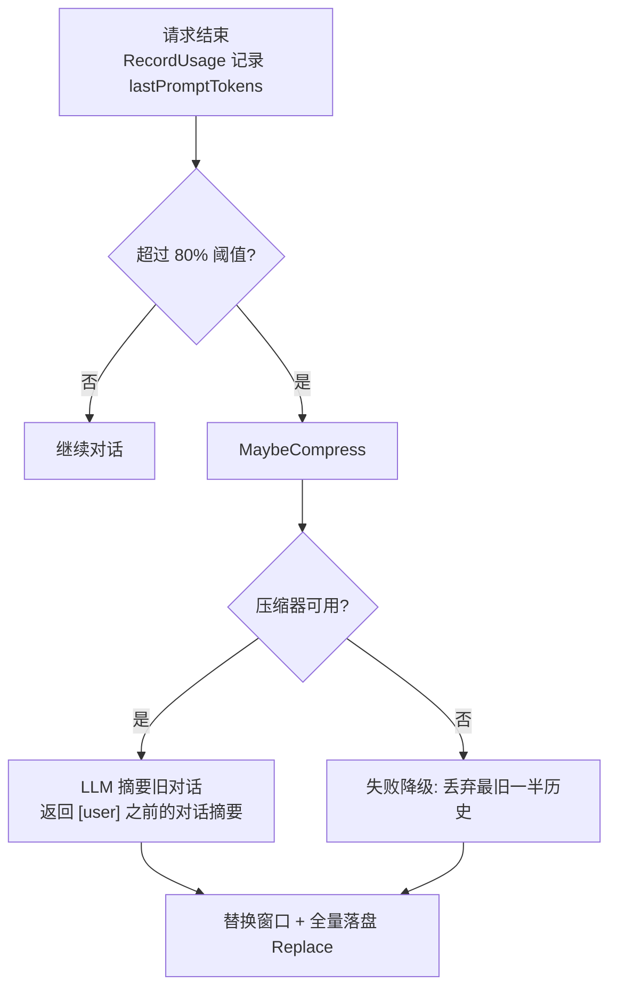
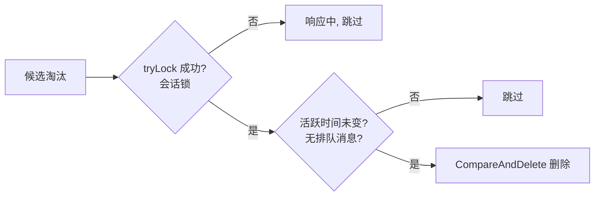

# AI 引擎（二）上下文、历史与记忆

本章介绍 Agent 的**状态管理**：token 预算上下文窗口如何工作、超限时如何压缩、对话历史如何跨重启持久化、内存中的会话缓存如何回收，以及 AI 长期记忆的实现。

## messageWindow：token 预算上下文窗口

`messageWindow` 不是固定轮数的滑动窗口，而是**按 token 预算管理**的窗口：

- 每次请求结束后记录 `lastPromptTokens`（最后一次 LLM 调用的 prompt 数，即当前上下文真实大小）
- 一旦超过 `max_context_tokens × 80%`，下一轮请求前触发 `MaybeCompress`
- `max_context_tokens` 默认 128000，可配置



### 压缩器

- 压缩调用独立 LLM（可配置更便宜的压缩专用模型 `compressor.*`，未配置复用主模型）
- 摘要以 **user 角色**消息保存（`"以下是之前的对话摘要：..."`），而非 system：system 位置已被完整 basePrompt 占用，重复 system 会稀释指令且浪费 token
- 压缩 prompt 明确要求「保留关键信息、用户意图、讨论结论和重要上下文，省略工具调用细节和中间推理过程」
- 压缩的 token 消耗并入当次请求统计（`compressUsage`），但不计入迭代轮数
- 压缩判定通过后、真正执行前触发 `PreCompact` 钩子（仅通知，见 [AI 引擎（三）](/internals/agent-tools#钩子系统-hooks)）

### 失败降级：truncateOldestHalf

压缩失败（网络抖动恰好在上下文最满时最易发生）**不能阻断对话**，直接丢弃最旧一半历史：

- 切点需对齐 `tool_call` 边界：保留区第一条若是 tool 结果消息，其对应的 assistant tool_calls 已在被丢弃的一半中——孤立 tool 消息会被 OpenAI 兼容 API 拒绝（sticky 400）。因此切点后移越过所有孤立 tool 消息；极端情况下清空历史（等效新对话，请求合法）
- 截断后 `lastPromptTokens` 置 0，若仍超阈值下一轮会再走压缩/截断，逐步收敛

## 历史持久化

### HistoryStore 抽象

```go
type HistoryStore interface {
    Load(ctx context.Context) ([]Message, error)
    Append(ctx context.Context, messages []Message) error // 增量追加
    Replace(ctx context.Context, messages []Message) error // 全量覆盖（压缩/截断后）
    Clear(ctx context.Context) error
}
```

两个写入语义的设计动机：常规对话用 **Append 增量**（行级存储只 INSERT 新行，避免整条历史反复全量重写的写放大），压缩/截断后历史重排才用 **Replace 全量覆盖**。

### SQL 行级存储（推荐）

SQL 后端下（探测 `storage.SQLBackend`）建两张表：

- `ania_chat_session`：每会话一行，`msg_count` 兼作序号分配器
- `ania_chat_message`：每消息一行，`(session_id, seq)` 联合主键，无外键（应用层维护一致性）

Append 在事务内读取并推进 `msg_count` 分配 seq，只 INSERT 新行；Replace 清空该会话消息并重排 seq；Clear 删除两表对应行。SQLite 单连接（`MaxOpenConns(1)`）下读取遵循「收集→关闭 rows→解析」纪律，写入在单事务内完成。

### KV 回退

非 SQL 后端回退为 `history:` 命名空间整段 JSON（`newPersistentHistoryStore`），语义一致。

### 图片降级落盘

落盘副本中的图片片段一律降级为文本标记 `[图片 <hash>]`：

- 远程 http(s) URL（QQ 临时链接）重启后失效，无保留价值
- data URI（base64 内联）体积可达 MB 级，原样落盘会撑大单行体积
- 只影响落盘数据；内存中当前会话仍保留图片供本轮使用

### 后台落盘

`persistAppend` 使用**独立的后台 context**，避免请求被 `/stop` 取消时丢失刚写入的历史；落盘失败仅记录日志，不影响内存对话。

## 会话缓存与回收

`pluginaichat` 用 `sync.Map` 持有每个会话的 `chatEntry`（ChatBot + lastActive 时间戳）。会话只增不减会导致内存线性增长，因此有 janitor 回收：

- **闲置淘汰**：1 分钟 tick，闲置超过 `session.max_idle_minutes`（默认 120，0 禁用）的会话被淘汰
- **LRU 上限**：驻留超过 `session.max_sessions`（默认 128，0 禁用）时淘汰最久未活跃的
- 只有指向 AI 的交互才刷新活跃时间——繁忙群里没人 @ 的死会话不会被误认为活跃

### 淘汰的安全性



- 响应中的会话持有会话锁，`tryLock` 必然失败 → 跳过
- 拿锁后复检活跃时间与排队队列，防止「刚被新消息触达」的会话被误删
- 只删内存对象：历史已持久化，下次发言 `getChat` 自动重建并回放
- 已知副作用：会话内 `mcp_load` 动态加载的工具随淘汰失效（等同重启）

### 群聊自动清理

群里连续 30 条消息无人 @ 机器人时，自动清空该群对话缓存（历史、动态 MCP 工具），防止群消息被无意中计入上下文。清空与进行中的对话共用会话锁，避免并发读写。

## 长期记忆（memoryManager）

与上下文窗口不同，长期记忆**跨会话、跨重启**保留，由 AI 通过 `memory_save` / `memory_search` / `memory_forget` 工具自行管理：

- **作用域隔离**：scope = `g:群ID` / `f:用户ID`，工具在注册时绑定 scope，从机制上保证记忆不会跨会话泄露
- **去重**：内容规范化（空白折叠）后相同则不重复写入
- **上限**：`memory.max_entries`（默认 200），写满返回 `ErrMemoryFull`，提示 AI 先清理或合并
- **截断**：单条内容上限 2000 符文
- **检索**：无 query 时返回全部（新在前）；有 query 时关键词打分（标签命中权重大于内容命中），零分剔除后排序
- **语义向量**：可选 embedding（与知识库共享 `embedder`），入库时计算向量，检索时语义加分；embedding 服务不可用时静默降级为纯关键词
- **存储**：SQL 后端下每条记忆一行（`ania_memory`，`(scope,id)` PK，tags/embedding JSON 列，`created_at` 定宽 UTC 文本使文本序 = 时间序）；非 SQL 回退每 scope 一个 JSON 数组
- 面板实现 `adminpanel.MemorySource`，可在「记忆管理」页直接增删改查，scope 校验 `^[gf]:\d+$` 防越界

## 备用识图（OCR）

主模型不支持多模态时，`load_images` / `local_image` 工具把图片交给**备用识别模型**（`ocr.*` 配置，默认 SiliconFlow 的 Qwen3-VL）生成文字描述，返回给 LLM；主模型支持多模态（`multimodal=true`）时则把图片推入队列、下一轮以图片上下文注入。

## 下一步

- [AI 引擎（三）工具、MCP 与高级编排](/internals/agent-tools) —— 工具如何定义、MCP/Skill/定时任务/子代理
- [AI 引擎（一）LLM 客户端与对话循环](/internals/agent-llm) —— 请求循环本身
- [技术原理总览](/internals/)

