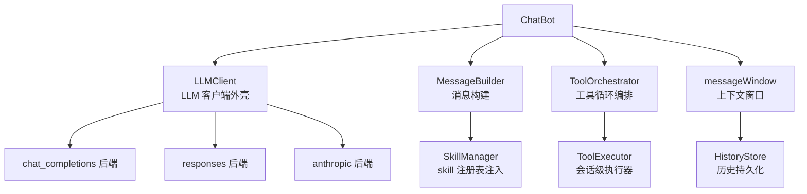
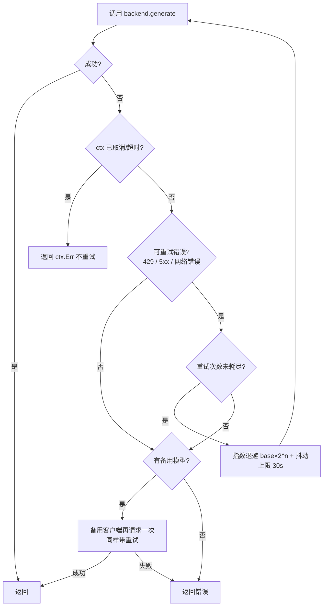
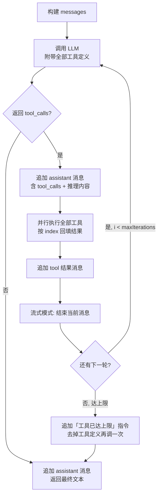

# AI 引擎（一）LLM 客户端与对话循环

本章介绍 AI Agent 的**核心循环**：从用户消息到 LLM 请求之间的全部技术细节 —— 三种 LLM API 格式如何统一、重试与备用模型、消息如何构建、多轮工具调用如何编排。

## ChatBot 的组成

`bot/component/aichat` 中每个会话对应一个 `ChatBot`，它由四个组件组合而成：



- `NewChatBot(baseURL, apiKey, model, prompt, maxContextTokens, toolExecutor, historyStore, opts...)`
- 主对话 / 子代理 / 定时任务 / OCR 各自创建独立 ChatBot，可配置不同的模型与上下文
- `SetMaxIterations` 控制工具循环轮数上限（主对话默认 20，子代理默认 10）

## LLMClient：多格式统一外壳

`LLMClient` 是插拔式后端的薄外壳，统一提供**应用层重试**与**备用模型切换**，三种 API 格式作为 `llmBackend` 接口的实现：

```go
type llmBackend interface {
    generate(ctx context.Context, messages []Message, opts ChatOptions) (GenerateResponse, TokenUsage, error)
    generateStream(ctx context.Context, messages []Message, opts ChatOptions) (resp GenerateResponse, usage TokenUsage, started bool, err error)
}
```

| 格式 | 实现 | 说明 |
| --- | --- | --- |
| `chat_completions` | `llmbackend_chatcompletions.go` | OpenAI Chat Completions（默认，DeepSeek 等绝大多数兼容 API），经 `openai-go/v3` |
| `responses` | `llmbackend_responses.go` | OpenAI Responses API，同一 SDK 的 `responses` 包 |
| `anthropic` | `llmbackend_anthropic.go` | Anthropic Messages API，`anthropics/anthropic-sdk-go` |

各后端负责**自己的消息转换、请求发送、流式累积与用量映射**；外层 `LLMClient` 不关心格式差异。

### 格式差异的抹平

三种协议的差异在各自后端内部消化：

- **system 提示词**：chat_completions/responses 作为 system 消息，anthropic 走独立的 `system` 参数
- **工具调用**：各自映射为 `tool_calls` / `tool_use` 结构，统一成内部 `llmtool.ToolCall{ID, Name, Arguments}`
- **max_tokens**：Anthropic 必填，未配置时默认 8192；且大 max_tokens 非流式请求会被 Anthropic 强制要求流式，后端统一走流式通道内部聚合，对外仍表现为一次性返回
- **深度思考**：
  - Anthropic extended thinking：`thinking.mode` 映射为 `budget_tokens`；thinking 块（含 signature / redacted data）序列化到 `Message.ThinkingBlocks`，多轮工具调用中**原样回传**（API 强制要求）；开启 thinking 时不允许下发 temperature/top_p/top_k
  - DeepSeek 风格 `reasoning_content` 存入 `Message.ReasoningContent`，同样在 tool calling 多轮中原样传回

### 重试与备用模型



- SDK 已内置 408/409/429/5xx 指数退避；本层补充 SDK 不覆盖的网络错误并自定义退避节奏，两层叠加
- 流式模式下**已输出首字节后失败不重试、不切换备用**——避免用户看到重复输出
- 所有等待尊重 ctx 剩余 deadline，取消/超时立即返回

### Token 用量语义

```go
type TokenUsage struct {
    PromptTokens     int  // 多轮累加（计费用）
    CompletionTokens int
    TotalTokens      int
    CachedTokens     int  // 上游 prompt 缓存命中（DeepSeek / OpenAI cached_tokens）
    LastPromptTokens int  // 最后一次调用的 prompt 数 = 当前上下文真实大小
    Iterations       int  // LLM 调用轮数
}
```

`LastPromptTokens` 与 `PromptTokens` 的区分是压缩阈值判断正确性的关键：前者代表上下文真实长度（用于触发压缩），后者是跨工具轮次的累加值（只适合计费统计）。

## 消息构建

`MessageBuilder` 负责把系统提示词、历史、当前输入组装成 LLM 请求：

```go
func (b *MessageBuilder) BuildChatMessages(userInput string, history []Message) []Message {
    // [system: basePrompt + skill 注册表] + history... + [user: [时间] 用户输入]
}
```

- 每条用户消息前缀 `[时间]`，让模型感知当前时间（工具调用的 time 结果与之呼应）
- system prompt 由「插件配置的提示词 + skill 可用列表 + 当前对话场景」组成，场景注入（`buildScenePrompt`）告诉 AI 自己在群聊还是私聊、消息 ID 前缀含义、记忆/知识库能力说明
- 图片上下文用 `BuildImageContextMessage`：每张图片前附 `[图片 <hash>]` 文本标签，与消息文本中的图片标记一致，便于 AI 区分和引用具体图片

## ToolOrchestrator：多轮工具调用循环

这是 Agent 的核心循环：**LLM → 工具调用 → 执行 → 结果回填 → LLM……** 直到模型不再请求工具。



### 关键细节

- **并行执行**：同一轮的多个工具调用并发执行（goroutine + WaitGroup），结果按 `index` 预分配回填，保证 tool 结果消息与 assistant 消息中 `tool_calls` 的顺序一一对应（OpenAI API 要求）；单个工具 panic 转为错误文本回填，不传染进程
- **回调串行化**：工具回调（发消息、图片加载队列等）内部可能修改共享状态，`lockedCallbacks` 用同一把互斥锁串行化；发送顺序可能不再等于调用顺序，但结果回填顺序不受影响
- **流式边界**：流式模式下每轮增量直接发到平台；工具边界调用 `OnStreamRoundEnd` 结束当前流式消息，下一轮首个增量创建新消息
- **迭代上限**：达到 `maxIterations` 后追加一条「工具调用已达限制，请直接回答」的用户消息，并**移除工具定义**再调一次——否则模型可能继续发起工具调用而被静默丢弃，导致空响应
- **中间轮文本**：非流式模式下，每轮 assistant 文本经 `callbacks.SendText` 发送（主对话）；定时任务/子代理的 SendText 回调则丢弃（仅记日志），见 [AI 引擎（三）](/internals/agent-tools)

### 图片加载的注入时机

工具执行后若 `TakeLoadedImages` 队列非空（`load_images` / `local_image` 工具推入），在回填工具结果之后追加一条图片上下文消息，让多模态模型下一轮看到图片：

```go
if imageURLs := callbacks.TakeLoadedImages(); len(imageURLs) > 0 {
    messages = append(messages, o.msgBuilder.BuildImageContextMessage(imageURLs))
}
```

## 会话内请求串行化

插件层保证同一会话同一时刻只有一个进行中的请求：

- 会话锁（`tryLock`）：基于缓存层 `SetString + WithCheckExist + TTL` 的**分布式锁**（Redis 后端可跨实例），10 分钟自动过期防死锁
- `rateCh` 并发槽：`plugin.ai_chat_bot.rate_limit`（默认 2）限制全局并发请求数
- 响应期间到达的消息进入**排队队列**（每会话上限 20 条），当前响应结束后合并为一轮逐条回应；`/stop` 取消当前请求并清空队列

## 下一步

- [AI 引擎（二）上下文、历史与记忆](/internals/agent-context) —— 上下文窗口如何按 token 预算压缩、历史如何持久化
- [AI 引擎（三）工具、MCP 与高级编排](/internals/agent-tools) —— 工具如何定义、MCP 如何懒加载、定时任务与子代理
- [技术原理总览](/internals/)

