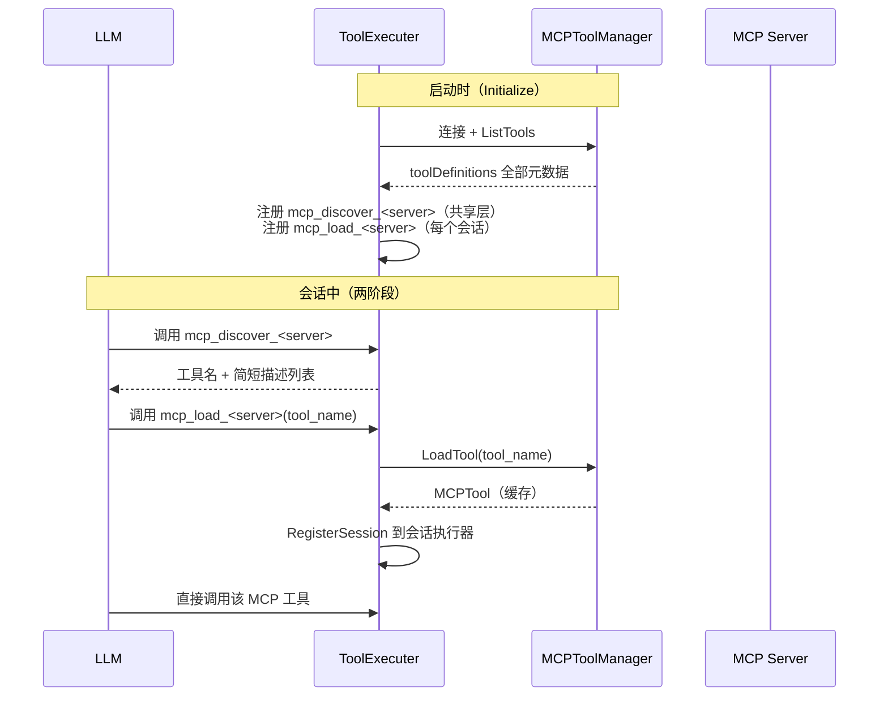
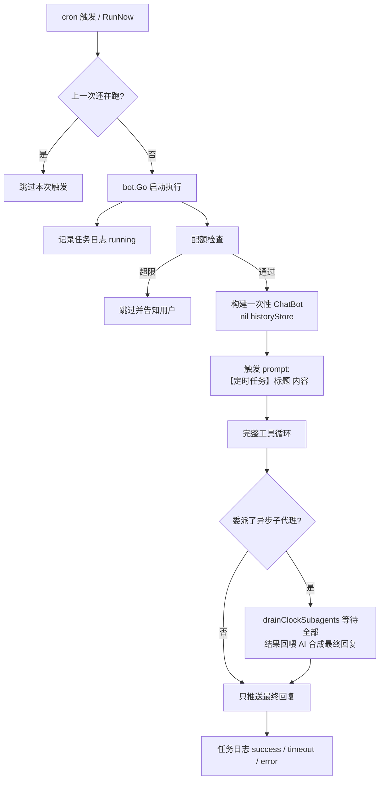

# AI 引擎（三）工具、MCP 与高级编排

本章介绍 Agent 的**能力扩展与高级编排**：工具如何定义与执行、MCP 如何两阶段懒加载、Skill 系统、AI 定时任务、子代理、Agent 团队、知识库与配额、钩子与工具门禁。

## 工具系统

### 工具抽象

一个工具是嵌入 `llmtool.BaseTool[ParamsType]` 的结构体，参数结构体用 `json` 标签命名、`desc` 标签描述：

```go
type WebSearchParams struct {
    Query string `json:"query" desc:"搜索关键词"`
}

type WebSearchTool struct {
    llmtool.BaseTool[WebSearchParams]
}

func (t *WebSearchTool) Name() string        { return "webSearch" }
func (t *WebSearchTool) Description() string { return "联网搜索" }
func (t *WebSearchTool) Execute(ctx context.Context, params *WebSearchParams, callbacks llmtool.CallBackFuncs) (string, error) {
    // ...
}
```

### 反射自动生成 Schema

`parser.go` 用 Go 反射从参数结构体自动生成 OpenAI 兼容 function schema——**无需手写 JSON Schema**：

- 字段类型映射：int/float→`number`，bool→`boolean`，slice→`array`，struct→`object`，其余→`string`
- 无 `omitempty` 的字段自动进 `required`；嵌套 struct / slice 递归解析
- MCP 工具则直接把 `inputSchema` 转为 OpenAI 格式（补充 `type/properties` 默认值与描述、枚举描述、required 排序）

### 确定性输出

工具列表按**名称排序**输出：Go map 遍历顺序随机，若直接序列化会导致每次请求 tools 字段排列不同，把上游 prompt 前缀缓存（DeepSeek context caching）全部打失。工具未找到的错误文本、skill 列表等一切回填给 LLM 的文本也都保证排序确定性。

### 执行器分层：共享 + 会话

```go
type ToolExecuter struct {        // 共享层：内置工具 + MCP manager
    tools       map[string]Tool
    mcpManagers []*MCPToolManager
}
type SessionToolExecutor struct { // 会话层：每个会话独立
    shared       *ToolExecuter
    sessionTools map[string]Tool  // 动态加载的 MCP 工具 + 会话绑定工具
}
```

- 每个会话创建独立的 `SessionToolExecutor`，`mcp_load` 等动态工具互不影响
- 同名工具会话层优先（定义与实际执行一致，避免重复 function 定义被提供方 400 拒绝）
- `SessionToolExecutor` 用 RWMutex 保护会话工具表：同一轮多个工具并行执行，`mcp_load` 并发写与其他工具读不会触发 Go map 并发 fatal

### 内置工具注册层级

| 层级 | 内容 |
| --- | --- |
| `CreateDefaultTools()` | 常开：`time`、`webSearch`/`webExplore`（Jina）、`get_msg_history`、`get_private_file_url`、`load_images`；配置门控：`bash`（黑白名单正则）、`send_file`、`local_image` |
| `CreateToolsWithMCP()` | 追加 MCP 工具（`mcpLazyLoad` 决定发现/加载模式或全量注册） |
| `CreateToolsWithSkill()` | 追加 `skill_read` / `skill_reload` 工具与 SkillManager |

另由 aichat 插件在会话层注册：`config_get`/`config_set`（配置中心读写，敏感字段掩码、仅注册键可写、重启生效——重启由管理员发送 `/reboot` 命令执行，AI 只负责引导）、`config_file_get`/`config_file_set`（扩展配置读写：`files.mcp_json`/`files.prompt_json`/`files.hooks_json`/`files.commands_json`，只校验 JSON 语法，hooks/commands/prompt 保存后数秒热生效、mcp 重启生效）、`mcp_list`/`mcp_add`/`mcp_remove`/`mcp_reconnect`（MCP 服务器自管理，写 `files.mcp_json` 持久化 + 运行时热注册/注销）、会话绑定的 clock/memory/knowledge/team/subagent 工具。其中配置修改类工具（`config_set`/`config_file_set`）执行前恒需管理员审批（与审批开关无关，请求者本人不能批准）。

### 回调桥（CallBackFuncs）

工具不直接接触平台，而是通过回调桥发送消息：

```go
type CallBackFuncs struct {
    SendText          func(text string) (string, error)
    SendImage         func(bs64content string) (string, error)
    SendFile          func(name, bs64content string) (string, error)
    GetMsgHistory     func(count, messageSeq int) (string, error)
    GetPrivateFileURL func(fileId string) (string, error)
    LoadImages        func() (string, error)
    TakeLoadedImages  func() []string
    LoadLocalImage    func(path string) (string, error)
}
```

主会话的回调把文本/图片/文件经 `bot.Bot` 发到当前群/私聊；定时任务与子代理的回调则**丢弃中间轮文本**（只记日志），只允许工具显式发送图片/文件，最终回复由编排层统一推送。

## MCP 两阶段懒加载

MCP（Model Context Protocol）接入通过 `modelcontextprotocol/go-sdk`，支持三种传输：**stdio**（子进程）、**Streamable HTTP**、**SSE**。



**为什么两阶段**：MCP 服务器可能暴露几十上百个工具，每个工具的描述都会进入 LLM 请求的 tools 字段——全量注册会让上下文爆炸。发现工具只读无副作用，加载按需进入会话；加载的工具在同一会话后续轮次中直接可用，与内置工具同权。

`plugin.ai_chat_bot.mcp.lazy_load`（默认 `true`）控制是否使用该模式：关闭后启动时全量注册所有 MCP 工具（`RegisterMCP`），工具列表恒定、上游 prompt 缓存命中率更高，但工具较多时上下文开销大。

其他细节：

- MCP 工具结果按 8000 符文截断（超大结果会永久留在窗口历史、撑爆上下文）
- 连接 HTTP 客户端不在整体 `http.Client.Timeout` 上设超时（会中断 SSE 长连接持续读取），改为 Transport 层 `DialContext` + `ResponseHeaderTimeout` 保护握手阶段
- 可选 `ToolFilterFunc`（前缀/名单/关键词/组合过滤器）在连接时过滤工具
- **运行时管理**：`ToolExecuter` 以 RWMutex 保护共享工具表与 manager 列表，支持启动后 `AddMCP` / `RemoveMCP` / `ReconnectMCP`（AI 的 `mcp_add` 等工具依赖此能力；重连后已加载到会话的旧工具句柄失效，需重新 `mcp_load`）

## Skill 系统

Skill 把领域知识封装成 `SKILL.md`（支持 frontmatter 的 `name` / `description`），AI **按需阅读**而非全量塞入：

- 目录结构：`skills/<name>/SKILL.md`（可带 reference.md、script.sh 等附属文件）或单文件 `skills/SKILL.md`
- `SkillManager` 启动时加载（`skills` 白名单可只加载指定项），`Reload` 原子替换注册表（面板上传/删除后热更新）；常驻的 `skill_reload` 工具走 `Refresh`（按最近一次的目录与白名单原地重载），供 AI 经 `bash` 等直接编辑本地 skill 文件后刷新缓存
- system prompt 注入 `available_skills` 注册表（名称 + 一句话描述），模型判断需要时调用 `skill_read` 读取完整内容
- 输出确定性：skill 列表按名称排序（作为工具结果文本回填给 LLM）
- **AI 自管理技能**：开启 `plugin.ai_chat_bot.skill_tool.enable`（默认关闭）后，会话注册 `skill_list` / `skill_install` / `skill_remove` 三个工具——找资源不做专用搜索工具（GitHub API 搜索有频控），AI 直接用已有的 `webSearch` / `webExplore` 上网搜索技能仓库或 zip 直链，再从 zip 直链 / GitHub 仓库（自动转 codeload zip）/ SKILL.md 直链下载安装，或直接撰写 SKILL.md 全文创建技能；安装/卸载复用面板同款磁盘逻辑（zip-slip / 体积 / 校验防护），热重载立即生效，操作记入操作日志
- **AI 自管理 MCP 服务器**：开启 `plugin.ai_chat_bot.mcp_tool.enable`（默认关闭）后，会话注册 `mcp_list` / `mcp_add` / `mcp_remove` / `mcp_reconnect` 四个工具——添加/删除经 DI 注入的 `ConfigEditor` 写入 `files.mcp_json` 持久化（名称校验满足 LLM 工具名规范，环境变量/请求头以 `KEY=VALUE` 列表传参），同时调用 `ToolExecuter.AddMCP` / `RemoveMCP` 运行时热注册/注销立即生效（持久化失败会回滚运行时注册；删除时运行时未注册的服务器容忍注销错误，保证配置层面删除总可用）；`mcp_reconnect` 对启动时连接失败从未注册的服务器会从配置读取定义重新注册

## AI 定时任务（clock）

与框架 `StartCron` 静态任务不同，clock 任务由 AI / 用户**动态创建**、持久化保存、重启不丢：

- `clockManager` 拥有**独立 `*cron.Cron`**（不与框架共享），任务存 `clock:` 命名空间（`task:<id>` + `index` + `seq`）
- 支持 5 字段 cron、`@every` 等、单次任务（`run_once` 执行后自动销毁）、按目标（群/好友）隔离

### 触发执行



- 每次触发**全新一次性上下文**（nil historyStore，执行完丢弃），带完整工具能力
- 超时 `clock.default_timeout_sec`（默认 120），超时后发消息告知用户
- 执行日志走 `bot/component/tasklog`（`ania_task_log` 行级 / KV 回退），记录工具调用明细、token 用量、最终回复；进程重启后遗留的 running 记录标记为 `interrupted`
- 中间轮文本丢弃，只有最终回复推送给目标；工具显式发送的图片/文件正常发出
- 用户经 `/clock` 管理，AI 经 `clock_create/list/update/delete/log` 工具管理

## 子代理（subagent）

`subagent_run` 让主 AI 委派复杂/耗时子任务给**一次性子代理**：

- 子代理是全新 `ChatBot`（nil historyStore，执行完丢弃），独立 `SessionToolExecutor`，拥有与主 AI 一致的会话级工具（clock/memory/knowledge），但**不再注册 subagent 自身**（防递归）
- 中间轮文本丢弃；发送图片/文件、读历史仍作用于当前会话
- 图片状态隔离：子代理有自己的图片队列，`LoadImages` 是 stub（推迟给主 AI），避免两个工具循环互踩队列
- 只有最终回复作为工具结果返回给主 AI，前缀运行元数据（时长、LLM 轮数、token），并按 `subagent.max_result_len`（默认 4000 符文）截断保护主上下文

### 超时预算

```go
func resolveSubagentTimeout(defaultTimeout, timeoutSec, parentCtx) (timeout, error) {
    // 1. timeoutSec 先限幅 int 再乘 time.Second（防溢出为负 duration）
    // 2. 父上下文带 deadline 时，为主请求预留 30s 收尾，压缩子代理超时
}
```

设计动机：框架对单次消息处理有总预算（`bot.msg_event_timeout_sec`，默认 5 分钟，面板可调）。子代理超时必须**早于**父 deadline 触发，超时才能作为工具结果优雅返回、让主 AI 用剩余时间完成最终回复；否则父 deadline 先触发，整个主请求以「请求超时」中止。`/stop` 通过父请求 context 一并取消子代理。

### 定时任务专属：异步子代理

clock 任务里注册的是**异步**子代理变体（`clocksubagent.go`）：子代理在后台并发执行（`subagent_run`/`subagent_list`/`subagent_cancel`），任务收尾时 `drainClockSubagents` 等待全部完成（预留 30s 合成预算），把结果回喂给同一个一次性 ChatBot 做多轮合成（上限 5 轮），只推送最终合成的回复。子代理超时随剩余预算收缩。

## Agent 团队（team）

在子代理之上的一层编排：AI 可保存/调用「团队」——一组带角色描述的子代理成员：

- 团队按 scope（`g:` / `f:` / 全局 `global`）隔离，`team:` 命名空间 KV 存取；团队名严格校验（中文/字母/数字/下划线/连字符）
- `team_run` 让多个成员**并行**执行（硬上限 10 个，防并发风暴），每个成员复用 `runSubagentWithOptions`（传角色提示词 + 团队默认参数）
- 成员结果汇总返回主 AI；团队定义可保存复用（`team_save/list/delete`），面板提供管理页
- 团队成员的一次性会话不注册团队工具（防递归组建团队）

## 知识库（knowledge）

`kb_add` / `kb_search` 等工具让 AI 把完整资料存入知识库并按需检索：

- 作用域：会话库（`g:` / `f:`）+ 全局库（`global`，所有会话可检索，仅面板可管理）
- **长文档切片**：入库时按 600 字符一块、60 字符重叠切片，检索命中块而非整篇，避免无关内容占用上下文
- 向量检索可选（与长期记忆共享 `embedder`）：每块一个 embedding（float32），检索按余弦相似度加分；embedding 服务不可用自动退化为纯关键词
- 去重（标题+内容规范化）、上限（`kb.max_docs`）、截断（8000 符文）

## 配额与用量统计

- **quotaManager**：按「每会话每日」+「全局每日」两个维度限制 token 消耗，键 `daily:<日期>:<会话key>` 天然按天过期；Check-Add 为宽松语义（非硬实时），面板可查看用量
- **usageAcc**：goroutine 安全的派生用量累加器，归集主循环之外的消耗（异步子代理、team 成员、备用识图），收尾并入统计与配额
- **Query 日志**：一次「触发 → 最终响应」的完整记录（`ania_query_log` / KV 回退），含用户输入、发送者、工具调用明细（上限 20 条 + 总数）、token、状态（running/success/stopped/timeout/error），面板「Query 日志」页按条件筛选

## 钩子系统（hooks）

`bot/component/agenthook` 提供会话生命周期钩子，两种形态共存：

- **Shell 钩子**（管理员配置）：面板「扩展配置」页编辑 `files.hooks_json`，在事件触发时执行配置的命令。载荷经 **stdin 以 JSON** 传入（`hook_event_name/session_id/agent_kind/tool_name/tool_input/tool_result/prompt`），退出码语义对齐 Claude Code：**0=通过**（stdout 作为上下文注入）、**2=阻断**（stderr 作为原因）、**其他=非阻断错误**（仅记日志）；超时（默认 10s，按条可覆盖，上限 60s）按非阻断错误处理
- **Go 钩子**（插件开发者）：插件实现 `agenthook.Handler` 接口（`OnAgentHook(ctx, event, payload) Result`），core 在启动后收集所有实现者，经 `HandlerRegistry` 扇出注入 pluginaichat；Go 钩子先于 shell 钩子执行，panic 自动隔离

事件一览：

| 事件 | 时机 | 可阻断 |
| --- | --- | --- |
| `SessionStart` | 会话（重）创建 | 否；产出的上下文在下一轮对话注入一次 |
| `UserPromptSubmit` | 用户消息进入对话前 | 是（回复原因给用户）；可注入上下文 |
| `PreToolUse` | 每个工具执行前（可按 `matcher` 正则匹配工具名） | 是（工具结果回填原因，循环继续） |
| `PostToolUse` | 每个工具执行后 | 否（仅通知） |
| `Stop` / `SubagentStop` | 主回复完成 / 子代理完成 | 否 |
| `PreCompact` | 上下文压缩即将发生 | 否 |

管理器以 5s TTL 重读配置中心，raw 变化才重新编译正则（面板编辑秒级热生效）；任一钩子阻断即短路后续钩子。引擎层（`aichat`）只依赖窄接口 `HookRunner`，自身不碰 shell——依赖方向保持 `aichat → agenthook → functool`，无反向依赖。

## 工具门禁管线

每个工具调用在 goroutine 内、真正执行前经过请求级门禁（`ChatOptions.PreToolGate`），顺序固定：

1. **计划模式**（内存判断，最便宜）：`/plan on` 期间副作用工具（bash/file/config_set/config_file_set/记忆写/知识库写/clock 增删改/skill/mcp 管理/子代理/团队）直接阻断，`todo_write` 刻意放行（清单是规划工作流的一部分）
2. **PreToolUse 钩子**（shell 有界 10s）
3. **管理员审批**：配置修改类工具（`config_set`/`config_file_set`）恒需管理员回复「允许」才执行，请求者本人不能批准，与审批开关无关。审批提示优先私聊发给管理员（`requestAdminOnly`：待批请求同时登记在发起会话键与管理员私聊索引，两处回复均可批），管理员私聊发送失败时回退到发起会话；无权者的审批回复会被消费并提示
4. **人工审批**（等真人，最贵放最后——已被否决的工具不再打扰用户）：`approval.tools` 列出的工具由请求者或管理员批准

阻断文本作为该工具的结果消息回填（语义等同工具报错），循环继续，面板 Query 日志可见被拦调用。门禁在 goroutine 内调用而非 spawn 前统一调用：审批等待不阻塞同轮并行工具的启动。

## 任务清单（todo_write）

内存态、按会话隔离的任务清单工具（全量替换语义，对齐主流 agent）：校验 status 合法性、单一项 in_progress、条数/字数上限；空数组即清空。仅注册到主会话（子代理/定时任务的一次性会话不共享父清单）。有未完成项时在后续对话**尾部注入** `<todo_reminder>` 提醒，内容哈希去重——清单没变不重复注入，避免每轮污染上下文。

## 工具审批与 bash 三段式

`approvalManager`（pluginaichat）：配置工具执行前向会话发送确认消息，请求发送者或管理员回复「允许/同意/allow/yes」或「拒绝/deny/no」决定放行，超时（默认 120s，钳制 10~240s）自动拒绝；结论写入操作日志（`tool_approval`）。回复拦截位于消息入口**第一行**（审批等待期间会话锁被占、回复通常不带 @）；每会话互斥锁把并行工具触发的多个审批串行化逐个提示；`/stop` 经同一 context 取消等待。子代理/定时任务路径 requester 为 0，仅管理员可批。

bash 工具为命令级三段式：黑名单命中→拒绝；白名单命中→放行；都不命中（含均未配置）→ 经 `CallBackFuncs.RequestApproval` 走上述审批，审批未启用（`RequestApproval` 为 nil）时默认放行。`RequestApproval` 在并行回调包装层（`lockedCallbacks`）**透传不加锁**——审批阻塞 ~120s，进互斥锁会卡死同轮其他工具的 SendText。

## 自定义斜杠命令

`commandManager` 把 `/名 参数` 映射为提示词模板（`files.commands_json`，5s TTL 热生效）：命中后消息被改写为展开后的单文本段（`$args` 替换为参数，无占位符则追加），走正常对话流程（排队/批处理/知识库/记忆注入不变）。名称受正则约束且不得撞内置命令；`/cmd add/del` 仅管理员。

## 下一步

- [AI 引擎（一）LLM 客户端与对话循环](/internals/agent-llm) —— 循环底层
- [AI 引擎（二）上下文、历史与记忆](/internals/agent-context) —— 状态管理
- [技术原理总览](/internals/)
