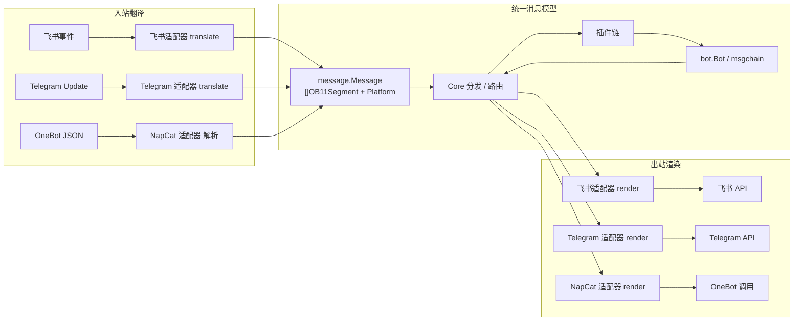
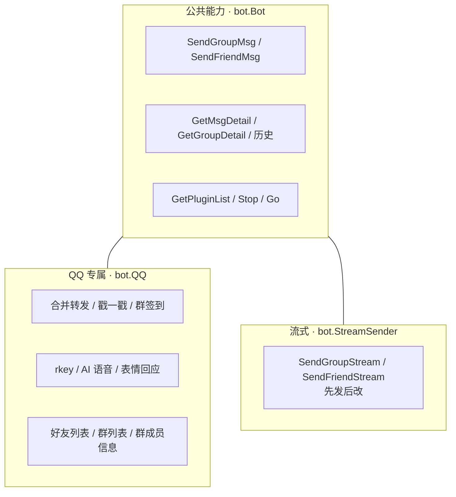
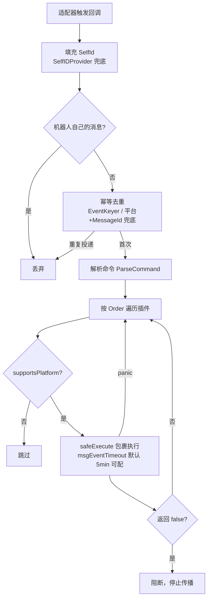
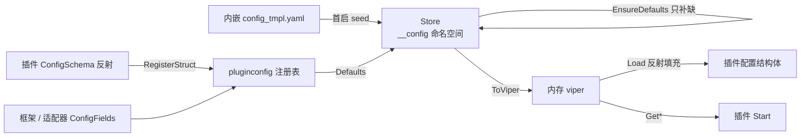

# 框架核心原理

本章深入介绍 AniaBot **框架部分**的技术原理：如何把五个差异巨大的平台归一化成同一种消息模型、事件如何沿插件链分发、插件生命周期与依赖注入如何工作、配置中心与存储层如何设计。

## 多平台归一化模型

AniaBot 所有平台共享同一套内部消息模型，适配器在边界做双向翻译。

### 1. 统一消息段：OB11Segment

框架以 **OneBot v11 消息段格式**作为规范形态（`common/model/message`）：

```go
type OB11Segment struct {
    Type string         // "text" / "at" / "image" / "face" / "reply" / "video" ...
    Data map[string]any
}
```

- **入站**：适配器把平台事件翻译成 `message.Message`（内含 `[]OB11Segment` 与统一字段 `MessageId / UserId / GroupId / Sender / SelfId / Platform`）
- **出站**：插件用 `msgchain.Builder()` 构造段数组，core 路由后由适配器翻译成平台 API 调用



各平台都实现一套 `translate.go`（入站）与 `send.go`（出站），例如飞书把 `post` 富文本块翻译成 text/at/image 段，Telegram 把 `message_entity` 翻译成 at/face 段，Discord 把 `MessageCreate` 翻译成文本段。

### 2. 统一 ID：QID + 前缀体系

```go
type QID string // 提供 String() / Uint64()
```

- **QQ 统一带 `qq:` 前缀**：旧版裸数字数据在启动时自动迁移，未迁移的裸数字 ID 仍兼容回退到 QQ
- 其他平台统一带前缀：QQ 官方 `qo:`、飞书 `fs:`、Telegram `tg:`（消息 ID 为 `tg:<chat_id>:<message_id>`）、Discord `dc:<channel_id>:<message_id>`
- 前缀在适配器的 `Definition.IDPrefix` 中声明，注册时**重复前缀直接 panic**（启动期编程错误）

### 3. 能力分层：公共接口 + 可选接口

平台差异不可能全部塞进一个接口，AniaBot 采用「洋葱」式能力模型：



- 适配器侧对应 `adapter.QQExt` / `adapter.StreamSenderExt` 等可选接口
- `adapter.WrapBot(base, src)` 按事件来源适配器把公共 `bot.Bot` 包装成带专属能力的扩展外观
- 插件侧 `if qb, ok := b.(bot.QQ); ok` 类型断言探测，断言失败即平台不支持，优雅退化

```go
// 框架在 addAdapter 时完成包装，事件分发时把包装后的外观传给插件
func (ania *AniaBot) addAdapter(def adapter.Definition, a adapter.Adapter) {
    e := &adapterEntry{def: def, adapter: a}
    e.evBot = adapter.WrapBot(ania, a) // 应用全部已注册 BotWrapper
    a.SetTrigger(ania.makeTrigger(e))
    ania.adapters = append(ania.adapters, e)
}
```

### 4. 消息段能力声明

适配器还可实现 `adapter.SegmentSupport` 声明出站能渲染的段类型集合；core 发送时对不支持的段类型**告警但不阻断**（替代适配器出站静默丢弃）。

## 适配器注册表

新增平台零核心改动，靠的是 `common/adapter` 的注册表：

```go
type Definition struct {
    Name         string                  // 适配器名，启用键 bot.platform.<name>.enable
    Platform     string                  // 平台标识（"qq" / "feishu" / ...），写入事件 Platform
    IDPrefix     string                  // ID 前缀（"qq:" / "fs:" / "tg:" / "dc:"）
    ConfigFields []pluginconfig.Field    // 面板动态渲染的配置字段
    New          func(*viper.Viper) (Adapter, error)
}
```

- 平台包在 `init()` 中调用 `adapter.Register(d)`，重复注册 / 重复前缀 panic
- `Definitions()` 按 Name 排序返回，保证遍历稳定
- core 在 `Run()` 中遍历注册表，按 `bot.platform.<name>.enable` 创建实例
- 平台专属能力通过 `RegisterBotWrapper(w)` 注册包装器，`WrapBot` 依次应用

```go
// cmd/main.go 新增平台只需一行空白导入
_ "github.com/jeanhua/AniaBot/bot/adapter/discord"
```

## 事件分发管线

适配器通过 `SetTrigger(TriggerWrapper)` 拿到一组回调，事件从平台进入 core 后经历完整的分发管线：



### 真实代码路径

上面是逻辑视图，实际实现（`bot/core/core.go`）就是一条几十行的函数：每个适配器在 `makeTrigger` 中注入回调，回调携带来源适配器 entry（平台过滤与能力包装都依赖它）：

```go
func (ania *AniaBot) onGroupEvent(e *adapterEntry, msg message.Message) {
    ania.fillSelfID(e, &msg)               // 1. SelfId 兜底（SelfIDProvider）
    if msg.Sender.UserId == msg.SelfId {   // 2. 自消息过滤
        return
    }
    if key, ok := ania.messageDedupKey(e, msg); ok && !ania.tryClaimEvent(key) {
        return                             // 3. 幂等去重（EventKeyer / 平台+MessageId）
    }
    cmd := utils.ParseCommand(msg)         // 4. 命令解析：一次解析，整条插件链共享

    for _, p := range ania.plugins {       // 5. 平台过滤 + 中间件链
        if !ania.supportsPlatform(p, e.def.Platform) {
            continue
        }
        next, panicked := safeExecuteWithReturn("群聊消息事件", p, func(p plugin.Plugin) bool {
            msgCtx, cancel := context.WithTimeout(ania.ctx, ania.msgEventTimeout())
            next, err := p.OnGroupMsg(msgCtx, e.evBot, cmd, msg) // e.evBot = 能力包装外观
            logError(err, p, "群聊消息事件")
            cancel()
            return next
        })
        if panicked {
            next = true // panic 不阻断，继续传播
        }
        if !next {
            break        // 插件返回 false：阻断
        }
    }
}
```

几个实现要点：

- **SelfId 兜底**：`fillSelfID` 仅在事件没带 `self_id` 时调用适配器的 `adapter.SelfIDProvider.SelfID()`（如飞书首次被 @ 前的空窗期），保证自消息过滤与 @ 提及检测（`at` 段 `Data["qq"]` 与 `SelfId` 精确比较）永远有效
- **命令只解析一次**：`ParseCommand` 在分发前完成，所有插件收到同一个 `command.Command`，避免每个插件重复解析文本
- **超时按插件独立**：每个插件调用都 `context.WithTimeout(...)`（消息处理默认 5 分钟，面板 `bot.msg_event_timeout_sec` 可调；通知 5 分钟、生命周期事件 1 分钟），即使某个插件阻塞到超时，其余插件仍按顺序执行
- **`e.evBot` 是事件来源适配器的能力外观**：分发前由 `addAdapter` 用 `adapter.WrapBot(ania, a)` 包装，插件在回调里类型断言 `bot.QQ` / `bot.StreamSender` 探测的就是它

### 幂等去重

事件订阅多为 **at-least-once 投递**（飞书断线重连 / ACK 丢失会重推）。core 统一按去重键去重（`dedup.go`）：

- 适配器实现 `adapter.EventKeyer` 提供稳定键（优先）
- 消息兜底键 = `平台 + MessageId`；通知不做组合兜底（避免同一秒两次真实事件被误判）
- 存储用缓存层（内存 map / Redis `SET NX EX`），TTL 10 分钟，有界
- **fail-open 语义**：去重存储故障时放行——at-least-once 下宁可重复处理一次，不能静默丢消息

### 平台过滤

每个插件按 `Meta.Platforms` 过滤：`Platforms` 为空表示支持全部平台（向后兼容），否则仅当事件来源平台的标识命中时才收到事件。QQ 专属通知（戳一戳、运气王……）在非 QQ 平台永远不会触发。

### 中间件链

消息事件按 `Order` 从小到大执行，返回 `(bool, error)`：

- `true` → 继续传播；`false` → 阻断（后续插件收不到）
- 三档参考值：`LevelLog(-1000)` → `LevelNormal(0)` → `LevelPostHandle(1000)`（AI 对话插件在最后，作为兜底响应）
- 插件 panic **不阻断**：`safeExecuteWithReturn` 捕获后视为 `true` 继续传播（与通知事件一致）
- 每个插件调用都有独立超时（消息 5 分钟、生命周期事件 1 分钟），防止插件挂死拖垮整个分发

### 通知广播

14 种公共通知与 `OnPlatformEvent` 平台事件是**广播制**：全部插件都会收到、无阻断、某个插件 panic 不影响其他插件。

## 命令解析与消息提取

所有插件共享的 `command.Command` 由 `bot/utils` 提供，核心是两条函数：

```go
// ParseCommand 把消息文本解析成命令；非 "/" 开头的消息返回空命令（仅携带 Mention）
func ParseCommand(msg message.Message) command.Command {
    input, mention := ExtraMessageStr(msg)
    if input == "" || input[0] != '/' {
        return command.Command{Mention: mention}
    }
    parts := strings.Fields(input[1:]) // 去掉 "/" 后按连续空白切分
    return command.Command{Name: parts[0], Args: parts[1:], Mention: mention}
}

// ExtraMessageStr 只拼接 text 与 at 段；@ 到机器人自己时置 mention=true
func ExtraMessageStr(msg message.Message) (string, bool) {
    var builder strings.Builder
    mention := false
    for _, m := range msg.Message {
        switch m.Type {
        case "text":
            builder.WriteString(m.Data["text"].(string))
        case "at":
            if qq, ok := m.Data["qq"].(string); ok && qq == msg.SelfId.String() {
                mention = true
            }
        }
    }
    return strings.TrimSpace(builder.String()), mention
}
```

- **只认 text / at 段**：图片、表情、视频等段不参与命令文本——`/meme 猫猫` 后面跟图片不会污染参数
- **`strings.Fields` 按连续空白切分**：支持多空格 / Tab，`/cmd a  b` 与 `/cmd a b` 等价
- **Mention 标记独立于命令**：`/clock list` 里 @ 机器人 与否不影响解析，AI 插件用 `Mention` 决定是否触发（未 @ 的群聊闲聊不触发）
- **Data 用 comma-ok 断言**：消息段来自平台 JSON，`qq` 字段可能缺失或类型不对，直接类型断言会 panic——框架对此统一防御

## 插件生命周期与依赖注入

### 生命周期

```
AddPlugin() → 按 Order 排序
  → Start(ctx, cfg)       配置结构体已填充、DI 已注入
  → StartCron(ctx, bot, c) 注册框架共享 cron
  → Awake(ctx, bot)        启动完成 1 秒后（首次向导未完成时跳过）
  → OnGroupMsg / OnFriendMsg / OnXxxNotice / OnPlatformEvent  运行期事件
  → OnPanic(ctx, bot, name, err)  任何插件或 bot.Go 协程 panic 时
```

### 依赖注入

`Start` 前框架注入（`common/plugin.Meta` 字段）：

| 依赖 | 类型 | 说明 |
| --- | --- | --- |
| `Storage` | `storage.Storage` | 缓存层，已按插件名 base64 命名空间隔离 |
| `PersistentStorage` | `storage.PersistentStorage` | 持久化 KV，同样按插件名隔离 |
| `RestyClient` | `*resty.Client` | HTTP 客户端 |
| `Logger` | `*slog.Logger` | 结构化日志（已带插件名 group） |
| `SystemConfig` | `plugin.SystemConfig` | 管理员 ID 等系统级配置 |
| `ConfigEditor` | `plugin.ConfigEditor` | 配置中心读写（可能为 nil，需判空） |

注入实现是 `Meta.SetStorage(...)` 等 setter；`ConfigSchema()` / `ConfigFields()` 在 DI **之前**被调用（纯元信息声明，实现不得依赖注入字段，且必须每次返回同一指针）。

除启动前 DI 外，core 在全部插件 `Start` 完成后还有一轮**可选接口收集**（类型断言惯例，与面板 `XxxSource` 能力发现同款）：实现 `agenthook.Handler` 的插件会被收集为 AI 代理 Go 钩子，注入给实现 `agenthook.HandlerRegistry` 的插件（pluginaichat），见 [AI 引擎（三）](/internals/agent-tools#钩子系统-hooks)。

### 并发模型

- 插件每次调用被 `safeExecute` 包裹，panic 只影响自身
- 插件内需要协程时用 `bot.Go(name, f)`：panic 自动恢复并回调所有插件 `OnPanic`（每个 OnPanic 调用自身也有 recover，防止连环 panic 杀死进程），同时维护 goroutine 计数供面板展示
- WebSocket 适配器采用**工作池 + 消息队列**：连接层只收发，解析与分发在 worker 协程完成；`worker_count` 默认 `CPU×2`，队列满丢弃（日志可查），ACK 帧直接投递不排队（避免 worker 全部阻塞等 ACK 时互相饿死）

## 配置中心

所有配置存数据库（`ania_kv` 表，保留命名空间 `__config`），键为点分路径，值 JSON 编码以保留类型。

### 数据流



- `Init()`：首启写入默认配置并标记 `meta.setup_pending`（进入设置向导）
- `EnsureDefaults()`：只补缺失键，**永不覆盖**——插件升级新增配置键下次启动自动补齐
- `ToViper()`：构建内存 viper，插件 `Start(ctx, *viper.Viper)` 语义与历史完全一致
- `ANIA_` 环境变量可覆盖任意配置键（优先级最高、不写回数据库），容器部署友好

### pluginconfig：动态表单注册表

面板表单不是写死的，而是从注册表动态渲染：

- `ConfigRegistrar.ConfigFields()`：框架字段与适配器字段的低层声明方式
- `ConfigSchemaProvider.ConfigSchema()`：插件声明配置结构体，框架**反射** `cfg` 标签生成字段（key/label/type/group/help/sensitive/default），类型从 Go 字段类型推断，指针标量 = 可选参数（未设置时保持 nil），切片默认值逗号分隔
- 同一注册表、同键后者覆盖前者；面板表单自动出现新字段，无需改面板代码

### 环境变量引导

持久化存储本身不经过配置中心（避免鸡生蛋）：`ANIABOT_STORE_DRIVER`（sqlite|mysql）/ `ANIABOT_SQLITE_PATH` / `ANIABOT_MYSQL_DSN`。

## 双层存储

| 层 | 接口 | 后端 | 语义 |
| --- | --- | --- | --- |
| 缓存 | `storage.Storage` | 内存（默认）/ Redis | TTL、列表、`WithCheckExist` 原子占用 |
| 持久化 | `storage.PersistentStorage` | SQLite（默认）/ MySQL | KV/文档、重启不丢、无 TTL |

### 命名空间隔离

`Clone(prefix)` 返回带前缀的子存储，前缀可多级嵌套；框架注入时用 `base64(pluginName)` 隔离，插件之间永远不冲突。内存后端共享同一把锁与底层 map，Redis 后端共享连接。

### SQL 可选能力

SQL 后端额外实现 `storage.SQLPersistentStorage`（`SQLDB()` / `SQLDialect()`），与 `bot.QQ` 同款探测惯例：

```go
db, dialect, ok := storage.SQLBackend(p.PersistentStorage)
if !ok { /* 回退纯 KV，功能不缺失 */ }
storage.EnsureTables(ctx, db, dialect, storage.TableDDL{...})
```

- `EnsureTables` 幂等建表，双方言 DDL 各一组
- 插件自建表统一 `ania_` 前缀；约定 MySQL 字符串键 `VARCHAR(255) COLLATE utf8mb4_bin`、大载荷 `MEDIUMTEXT`、时间戳整数秒或定宽 UTC 文本
- **SQL/KV 双路径语义一致**：SQL 冗余过滤列只收窄 WHERE，Go 侧匹配仍是最终判定
- 探测/建表失败只记日志并回退 KV，绝不阻断插件启动

典型的「KV 抽象 + SQL 加速」案例：AI 对话历史（`ania_chat_session` / `ania_chat_message` 行级，追加只 INSERT）、长期记忆（`ania_memory`）、操作日志（`ania_op_log`）、Query 日志（`ania_query_log`）、任务日志（`ania_task_log`）——非 SQL 后端全部回退为命名空间 KV。

## 消息链构造器（msgchain）

插件发消息的统一入口是 `msgchain.Builder()`，它把「意图」翻译成 `[]OB11Segment`：

```go
msgchain.Builder().Group(target).Text("你好").Mention(qid).Reply(msgID).Build()
```

实现上是一个**可变段数组的流式 builder**（`common/msgchain`）：

- `Builder()` 返回空 `chainBuilder`，`Group()` / `Friend()` 各自创建独立的段数组（`[]OB11Segment`），群聊/私聊接口不同但共享同一份底层实现
- 每个方法只是 `append` 一个段；`Data` 用 `message.XxxMessage{...}.Marshal()` 序列化成 `map[string]any`——段的数据结构全部收敛在 `common/model/message`，适配器与核心不感知 builder 细节
- 段类型到 Data 的映射有明确约定：
  - `Mention(qid)` → `at` 段，`Data["qq"]=qid`；`Text()` → `text` 段；`Face()` → `face` 段
  - `ImageUrl()` **同时写 `file` 与 `url`**：`messageutils.ParseImage` 依赖 `url`（FriendlyText 渲染 / 历史回放），漏写会导致 AI 看到图片但拿不到地址
  - `ImageBase64()` → `file: "base64://<data>"`；`ImageLocal()` → `file: "file://<path>"`——三种形态统一写 `file` 键，适配器自行识别协议头
  - `Reply(msgID)` → `reply` 段，`Data["id"]=msgID`
- 合并转发是另一条路径：`GroupForward()` 预填 `ForwardMessageSegment{Prompt/Summary/Source}`，`Message(userId, nickname, chain)` 每调用一次追加一个 `node` 节点（`user_id` / `nickname` / `content` 子段数组），最终整段作为一个 `forward` 段交给平台
- `Build()` 返回只读接口（`GroupChain` / `FriendChain`），`GetGroupMsg()` 暴露段数组；接口隔离使插件拿到的链不可再被意外修改

## 流式发送：先发后改

AI 逐字输出时，若等全部生成完再发，用户体验差；AniaBot 用「**先发一条，再逐段编辑**」实现打字机效果。这是可选能力（插件侧 `bot.StreamSender` / 适配器侧 `adapter.StreamSenderExt`），只有支持「发后编辑」的平台实现——QQ/OneBot v11 没有消息编辑 API，断言失败时 AI 插件退化为一次性回复。

```go
type StreamHandle interface {
    Patch(text string) error // 用 text 替换已发送消息的内容（实现方负责节流与内容上限）
    End()                    // 结束流式（强制发送最终内容，幂等）
}
```

以 Telegram 实现（`bot/adapter/telegram/stream.go`）为例，完整展示「先发后改」的工程细节：

1. **创建**：`SendGroupStream` 把初始 chain 的文本段拼接为消息内容，`at` 段展开成 `@username ` 前缀文本，`reply` 段作为 `reply_parameters`，先 `sendMessage` 发出（内容按 4096 字节 rune 截断，不切断多字节字符），拿到 `message_id`
2. **Patch 节流**：`Patch` 只更新内存中的 `content`；距上次成功编辑 ≥ 600ms 才真正 `editMessageText`，否则合并到下一次——Telegram 编辑有频率限制，**End 时强制发送最终内容**
3. **前缀保留**：每次编辑都用 `prefix + content` 重新发送——AI 的 Patch 只回传增量文本，若不重新带上 `@username`，第一次编辑后提及就消失了
4. **最终渲染降级**：流式中间编辑一律纯文本（增量中的 markdown 标记不完整，带 parse_mode 会被 400 拒绝）；`End` 时才按配置把 AI markdown 转成 Telegram HTML 渲染，解析失败自动降级纯文本重发（还原未转换的原文）
5. **幂等跳过**：纯文本编辑且内容与上次成功发送一致时跳过——Telegram 会返回 400 "message is not modified"

## 平台适配器的五种连接模式

五个平台的事件接入方式各不相同，每个适配器的 `Serve(v *viper.Viper)` 是**阻塞的独立 goroutine**（core 逐个 `go a.Serve(cfg)` 启动），返回即适配器死亡，因此连接失败绝不早退。具体模式：

| 平台 | 连接模式 | 实现要点 |
| --- | --- | --- |
| NapCat WS | WebSocket（OneBot v11 正向） | `Serve` 无限重连（指数退避 1s 翻倍、封顶 30s）；token 必须 URL 编码（含 `+ / = &` 时直接拼接会破坏 query）；**worker 池**：连接层只收发，解析与分发在 worker（默认 `CPU×2`，队列 256，满则丢弃并记日志） |
| NapCat HTTP | HTTP 回调 + REST 反向调用 | 自带 HTTP 服务接收 NapCat 事件推送（注册在 `http.DefaultServeMux` 的 `/`——这正是面板/飞书 webhook 必须用独立 mux 的原因），发送走 OneBot REST 接口；**fail-closed**：未配置 token 时拒绝全部上报（防伪造事件注入），token 兼容 `Authorization: Bearer` 与 `access_token` 查询参数 |
| QQ 官方 | REST 换 token + WebSocket 网关 | 先 `tokenManager` 换 `access_token`（启动期暴露 AppID/Secret 错误，之后自动刷新）；网关握手：首条 `Hello`（携带心跳周期）→ `identify`（无会话）/ `resume`（有 `sessionID+lastSeq`，服务端补发断线期间事件）→ 心跳循环；断线按原因分类走 resume 或重新 identify（会话失效时清空会话），指数退避重连 |
| 飞书 | lark SDK 长连接 / Webhook | `larkws.NewClient(...).Start()` 阻塞，断线重连与心跳由 SDK 内部维护，适配器只挂状态回调；webhook 模式用独立 mux + 事件处理器（verification token / encrypt key 验签解密） |
| Telegram | Bot API 长轮询 | `getMe` 校验 token（指数退避无限重试）→ `getUpdates(offset, timeout=30s)` 循环；**先 claim 后处理**：同步按 `update_id` 去重并推进 offset（重推也要推进，否则死循环重推），已 claim 的更新 `go` 异步翻译分发，翻译/图片下载不阻塞轮询；Bot API 没有消息查询/历史端点，`GetMsgDetail`/历史用适配器内存 `msgCache` 兜底 |
| Discord | discordgo Gateway | Gateway WebSocket 收事件，心跳/断线重连/会话 resume 由库内部维护，`newSession` 失败指数退避无限重试；intents 订阅按配置声明 |

共性设计：

- **Serve 不早退**：配置缺失时只记日志并保持 `reconnecting` 状态（返回会让整个适配器死亡），用户改配置后重启生效
- **连接状态外露**：实现 `AdapterStatus()/Connected()`，core 汇总成 `AdapterStatuses()` 供 Web 面板状态总览展示
- **at-least-once 语义下先 claim 后处理**：重复投递被去重键拦截，崩溃窗口内已 claim 未处理的消息可能丢失（有界、可接受）

## Web 控制面板与审计

- 面板后端 `bot/adminpanel` 是**纯 `net/http`（零额外依赖）**：`http.ServeMux` + `go:embed` 内嵌 Vue SPA（`dist/`），前端构建产物打进二进制，单文件部署。**绝不注册到 `http.DefaultServeMux`**（NapCat HTTP 适配器占用了默认 mux 的 `/` 路由），NapCat HTTP 与飞书 webhook 同样各用独立 mux
- **认证**：首次启动生成 10 位随机密码打印到控制台（仅显示一次，登录后可修改）；密码存 `__admin` 命名空间，格式 `salt:hash`（16 字节随机 salt + SHA-256，hex 编码），校验用 `crypto/subtle.ConstantTimeCompare` 常数时间比较防计时侧信道
- **会话**：登录签发 32 字节随机 token（HttpOnly Cookie，24h 过期），内存 + 持久化存储**双写**——Bot 重启后旧会话仍有效；剩余有效期 < 12h 自动续期（滑动过期，活跃用户不被踢下线）；**修改密码吊销全部会话**（把可疑登录踢下线）；忘记密码可用命令行 `ResetPanelPassword` 覆盖哈希，并同样清空全部会话
- **登录防爆破**（`loginguard.go`）：按来源 IP 计数，10 分钟窗口内失败 5 次锁定 10 分钟，每次失败前固定延迟 500ms 拖慢在线爆破；仅当对端是回环地址时才信任 `X-Forwarded-For` / `X-Real-IP`（本机反代场景），否则外部伪造头部无法绕过锁定
- **插件能力发现**：面板通过 `adminpanel.XxxSource` 可选接口发现插件能力——`TaskLogSource`（任务日志）、`ClockTaskSource`（定时任务增删改查/启停）、`MsgLogSource`（消息日志环形缓冲 + 滚动分页）、`SkillSource`（skill 上传/删除/热重载）、`MemorySource`、`KnowledgeBaseSource`（含 URL 导入）、`TeamSource`、`QuotaSource`（用量查看/清零）、`QueryLogSource`。插件实现即出现在面板，无需面板代码改动
- **操作日志**（`bot/component/oplog`）：包级单例记录面板与 AI 工具的管理操作（登录、配置修改、定时任务/记忆/Skill/团队管理、AI 改配置、重启更新等），SQL 后端走 `ania_op_log` 行级存储（过滤条件下推 WHERE、容量淘汰走范围删除），KV 后端走 `e:<序号>` 逐条记录，ID 均为 base36 自增序号，两种后端一致；默认保留最近 500 条

## 进程自重启（sysrestart）

面板「重启 Bot」按钮、自动更新与系统插件的 `/reboot` 命令（仅管理员）共用 `bot/component/sysrestart.Self()`，实现极简但有一个关键陷阱：

- **Unix**：`syscall.Exec(exe, os.Args, os.Environ())` **原地替换进程**——PID 不变、文件句柄与控制台无缝衔接，重启对用户几乎无感
- **Windows**：没有 exec 语义，`exec.Command` 启动新进程（继承控制台与标准流）后 `os.Exit(0)`
- **`selfExe` 必须在包初始化时缓存**：自动更新的「改名交换」会把运行中的二进制 rename 为 `<exe>.old`，此后 Linux 上 `os.Executable()` 读 `/proc/self/exe`（跟随 inode）会指向旧二进制，导致 swap 换错文件、重启回旧版本。启动时缓存路径后，无论二进制如何被替换，重启永远使用最初那个路径

## 关键设计取舍

| 取舍 | 理由 |
| --- | --- |
| 配置存数据库而非 yaml | 面板可视化、多实例共享（MySQL）、插件配置动态注册 |
| 返回值 `(value, bool)` 而非 error | 适配器/存储层调用频繁且多为“尽力而为”，错误内部记日志，接口更轻 |
| 可选接口 + 类型断言而非大接口 | 平台能力差异巨大，大接口会让新平台适配成本暴涨 |
| 广播制通知 + 中间件链消息 | 消息需要“抢答/阻断”语义，通知需要“所有人都看到”语义 |
| 纯 Go 驱动（无 CGO） | 交叉编译开箱即用（sqlite 用 modernc.org、mysql 用 go-sql-driver） |

## 下一步

- [AI 引擎（一）LLM 客户端与对话循环](/internals/agent-llm) —— Agent 部分从哪里开始
- [技术原理总览](/internals/) —— 回到总览


