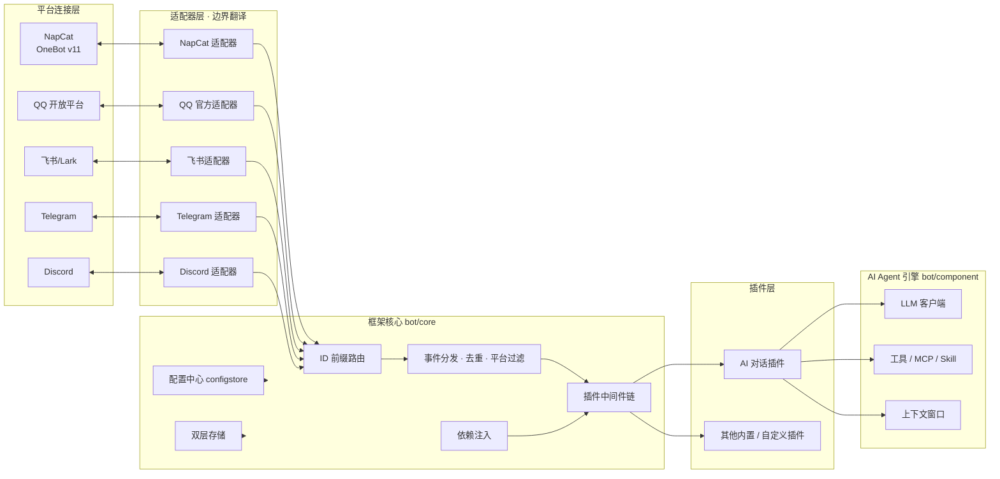
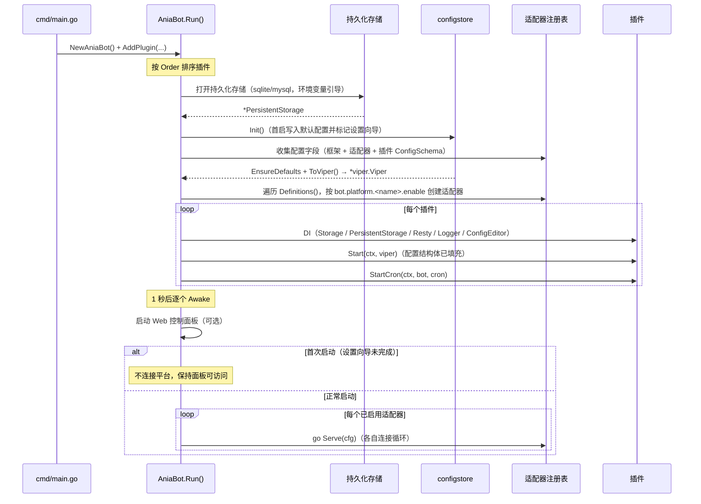
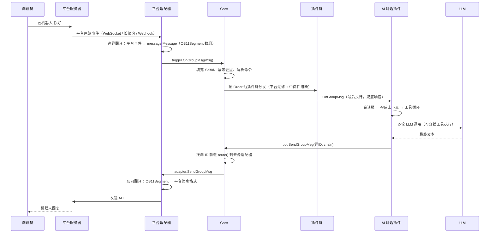

# 技术原理总览

本章从实现层面系统介绍 AniaBot 的技术原理：**框架部分**（多平台适配、事件分发、插件系统、配置中心、存储）与 **Agent 部分**（LLM 多格式客户端、工具调用循环、上下文窗口、历史持久化、记忆、定时任务与子代理）。

- [框架核心原理](/internals/framework) —— 多平台归一化、适配器注册表、事件分发管线（含真实代码路径）、命令解析与消息提取、插件生命周期、DI、配置中心、双层存储、消息链构造器、流式发送、五种平台连接模式、Web 面板认证与自重启
- [AI 引擎（一）LLM 客户端与对话循环](/internals/agent-llm) —— 三种 LLM API 格式后端、重试与备用模型、消息构建、多轮工具调用循环
- [AI 引擎（二）上下文、历史与记忆](/internals/agent-context) —— token 预算上下文窗口、LLM 压缩、行级历史持久化、会话缓存回收、长期记忆
- [AI 引擎（三）工具、MCP 与高级编排](/internals/agent-tools) —— 反射式工具 Schema、MCP 两阶段懒加载、Skill 系统、定时任务、子代理、团队、知识库

## 设计哲学：一切皆为插件

AniaBot 的核心思想是**框架只做连接与分发，功能全是插件**：

- 框架本体负责：连接平台适配器 → 把平台事件归一化为统一消息 → 沿插件链分发 → 把插件的发送请求路由回对应平台
- AI 对话、防撤回、复读、新闻推送……所有功能都是插件，与用户自定义插件地位平等
- 平台能力用「可选接口 + 类型断言」暴露：公共能力进 `bot.Bot`，平台专属能力进 `bot.QQ`，插件探测不到就优雅退化

## 启动时序

`cmd/main.go` 只做两件事：**空白导入**平台适配器包（触发各自 `init()` 向注册表注册），以及**注册插件**。真正的装配发生在 `bot/core/core.go` 的 `Run()` 中，顺序经过精心安排：

几个关键设计点：

- **持久化存储最先打开**：它是配置中心的载体，驱动与位置只能靠环境变量引导（`ANIABOT_STORE_DRIVER` 等），不经过配置中心，避免鸡生蛋问题
- **适配器先于插件 Start 创建**：保证 `setup_pending` 期间插件调用发送接口时适配器已就绪
- **配置结构体在 Start 前填充**：`ConfigSchema()` 返回的结构体由框架反射注册、补齐默认值并在 Start 前 `Load` 完成，插件直接读字段
- **首次启动不连接平台**：避免向导未完成时控制台刷重连日志；面板保持可访问，保存配置重启后正常连接

## 一次消息的旅程

以「群里 @机器人 发消息 → AI 回复」为例，完整走一遍数据流：

出站方向的关键是 `route(id)`：根据 ID 前缀（`qo:` / `fs:` / `tg:` / `dc:`）找到对应适配器；裸数字 ID（QQ 历史数据）命中无前缀的默认适配器。这就是「插件拿到的 `bot.Bot` 是平台能力包装后的外观、但发送时 core 自动路由」的实现基础。

## 阅读建议

- 想理解「框架怎么把多平台变成一种消息模型」「命令如何解析、消息链如何构造、流式回复如何先发后改、各平台如何连接」→ [框架核心原理](/internals/framework)
- 想理解「AI 怎么调用工具、怎么管理上下文」→ [AI 引擎（一）](/internals/agent-llm) 与 [（二）](/internals/agent-context)
- 想理解「MCP / Skill / 定时任务 / 子代理如何实现」→ [AI 引擎（三）](/internals/agent-tools)
- 想写插件 → [插件系统概览](/plugin/overview)；想查接口 → [API 参考](/api/events)
