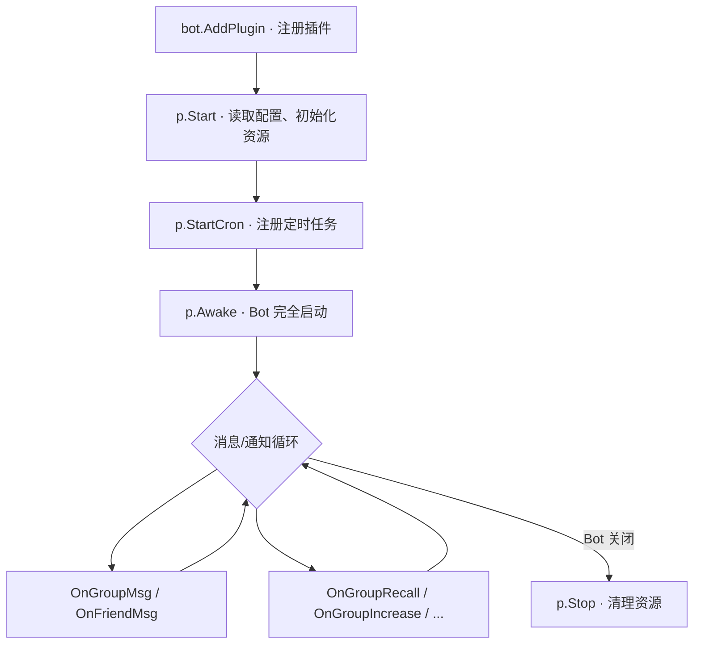
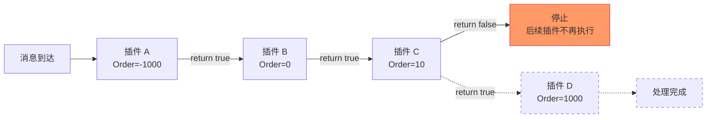

# 插件开发概览

AniaBot 的所有功能均通过插件实现。插件是一个实现了特定接口方法的 Go 结构体，框架在运行时自动调用这些方法。你只需要实现你关心的方法，其余的留空即可。

## 插件长什么样？

一个最简单的插件只需要三样东西：

1. 一个**结构体**（嵌入 `plugin.Meta`）
2. 一个**构造函数**（`NewPlugin()`）
3. 一个**消息处理方法**（`OnGroupMsg` 或 `OnFriendMsg`）

```go
package pluginhello

import "github.com/jeanhua/AniaBot/common/plugin"
import "github.com/jeanhua/AniaBot/common/plugininfo"

type HelloPlugin struct {
    plugin.Meta  // 嵌入 Meta，获得存储、日志、配置等能力
}

func NewPlugin() *HelloPlugin {
    return &HelloPlugin{
        Meta: plugin.Meta{
            Name:      "问候插件",          // 插件名称（唯一标识，勿随意修改）
            HelpWords: "发送 /hello 触发",  // /help 显示的说明
            AdminOnly: false,              // true 时非管理员看不到帮助信息
            ShowFor:   plugininfo.ShowForGroup | plugininfo.ShowForFriend,
            Author:    "jeanhua",
            Version:   "1.0.0",
            Order:     10,                 // 执行顺序，数字越小越先执行
        },
    }
}
```

::: tip 理解 plugin.Meta
`plugin.Meta` 是每个插件必须嵌入的基底结构体。它不是一个「父类」，更像是一个「工具箱」——嵌入后，你的插件自动拥有 `Storage`（存储）、`Logger`（日志）、`RestyClient`（HTTP 客户端）、`SystemConfig`（全局配置）等字段，可以直接使用。
:::

## Meta 字段说明

| 字段 | 类型 | 说明 |
|------|------|------|
| `Name` | string | 插件唯一名称，也是存储空间的隔离依据 |
| `HelpWords` | string | `/help` 命令展示的插件说明 |
| `AdminOnly` | bool | 是否仅管理员可见帮助信息 |
| `ShowFor` | uint | 显示范围：`ShowForGroup`、`ShowForFriend` 可按位组合 |
| `Author` | string | 插件作者 |
| `Version` | string | 版本号 |
| `Order` | int | 插件执行优先级，越小越先执行 |

::: warning 注意
`Name` 字段是插件存储空间的隔离依据（通过 base64 编码生成前缀）。修改插件名称后，原有持久化数据将无法访问。
:::

## 插件生命周期

插件从创建到运行，经历以下阶段：



**每个方法都是可选的**。如果你不需要读配置，就不实现 `Start`；不需要定时任务，就不实现 `StartCron`。框架只会调用你实现了的方法。

## 可实现的事件方法

### 消息事件

```go
// 群聊消息
OnGroupMsg(ctx context.Context, bot bot.Bot, cmd command.Command, msg message.Message) (bool, error)

// 私聊消息
OnFriendMsg(ctx context.Context, bot bot.Bot, cmd command.Command, msg message.Message) (bool, error)
```

返回值 `bool`：`true` 继续执行后续插件，`false` 阻止后续插件。

### 生命周期事件

```go
// 插件启动，读取配置、初始化资源
Start(ctx context.Context, cfg *viper.Viper) error

// 注册定时任务
StartCron(ctx context.Context, bot bot.Bot, c CronManager) error

// Bot 完全启动后触发
Awake(ctx context.Context, bot bot.Bot) error
```

### 通知事件

群/好友的各类通知，如撤回、入群、禁言等，详见 [事件接口参考](../api/events)。

## 插件执行流程：消息是怎么传递的？

当一条群消息到达时，框架会按 `Order` 从小到大依次调用每个插件的 `OnGroupMsg`：



这个机制让你可以：
- **拦截器插件**：用很低的 Order（如 -1000）先检查消息，决定是否放行
- **功能插件**：用默认 Order（0）处理业务逻辑
- **后处理插件**：用高 Order（1000）在所有插件执行完后做收尾工作

::: tip 什么时候 return false？
- 你的插件已经处理了这条消息，不想让后续插件重复处理 → return false
- 这条消息不属于你的插件，让下一个插件去处理 → return true
- 大多数情况下，return true 是安全的默认选择
:::

## 选择合适的 Order 值

| 场景 | 推荐 Order | 示例 |
|------|-----------|------|
| 拦截器/过滤器 | `< 0` | `plugin.LevelLog` (-1000) |
| 日志/监控 | `< 0` | `plugin.LevelLog` (-1000) |
| 普通功能插件 | `0` | `plugin.LevelNormal` (0) |
| 后处理/统计 | `> 0` | `plugin.LevelPostHandle` (1000) |

框架预定义了三个常量：
- `plugin.LevelLog = -1000` — 日志级别，最先执行
- `plugin.LevelNormal = 0` — 正常级别
- `plugin.LevelPostHandle = 1000` — 后处理级别，最后执行

实际项目中的例子：
- 消息拦截器（`interceptor`）使用 `plugin.LevelLog + 1`，确保在所有功能插件之前过滤消息
- AI 对话插件（`pluginaichat`）使用 `plugin.LevelNormal`，正常优先级
- 你可以根据需要选择任意整数值

## 注册插件

在 `cmd/main.go` 中通过 `AddPlugin` 注册：

```go
bot.AddPlugin(pluginhello.NewPlugin())
```

插件会按 `Order` 从小到大的顺序依次执行。

## 常见错误

### 忘记嵌入 plugin.Meta

```go
// ❌ 错误：没有嵌入 Meta
type MyPlugin struct {
    Name string
}

// ✅ 正确：嵌入 Meta
type MyPlugin struct {
    plugin.Meta
}
```

没有嵌入 `Meta`，你的插件就没有 `Storage`、`Logger` 等字段，也无法被框架识别。

### Name 字段为空

```go
// ❌ 错误：Name 为空
Meta: plugin.Meta{
    Name: "",
}

// ✅ 正确：给一个有意义的名称
Meta: plugin.Meta{
    Name: "我的插件",
}
```

`Name` 为空会导致存储前缀生成异常，不同插件的数据可能互相覆盖。

### 修改了 Name 导致数据丢失

插件上线后，`Name` 字段就不要改了。它参与了存储 key 的生成，改了之后旧数据就读不到了。

## 下一步

- [第一个插件](./first-plugin) — 动手写一个完整的 Hello 插件
- [消息构造器](./message-builder) — 构造各类消息
- [命令解析](./commands) — 处理命令和参数
- [数据存储](./storage) — 持久化插件数据
- [常见模式](./patterns) — 学习插件开发的常用设计模式
